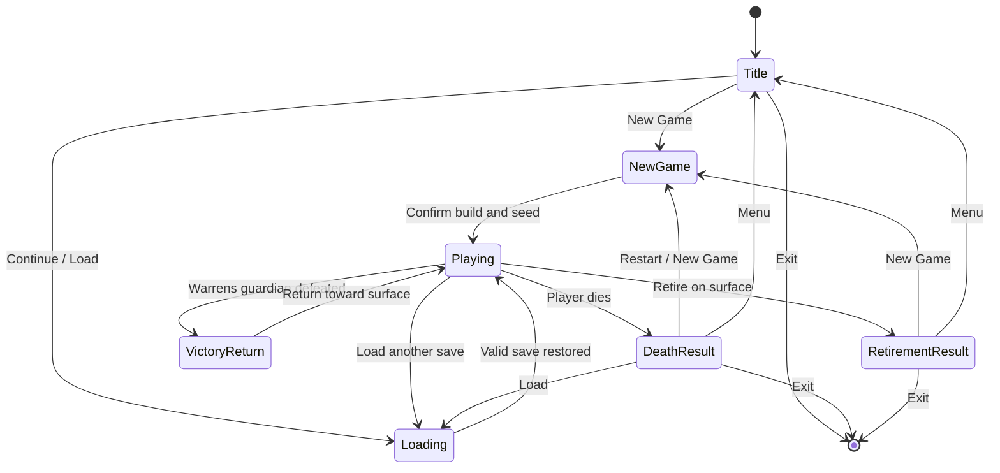

# Phase 17: Complete Player Journey Vertical Slice

Status: Phase 17 is active. Gates 0-4 are complete; Gate 5 is next. Gate 0 fixed the original journey contract against base commit `09291410`. After Gate 2, the user replaced the original Echo target with RFB's Warrens as the first player flow and explicitly allowed Echo Depths to stay out of the release journey. Gate 3 completed that bounded content and campaign migration. The post-Gate-3 contract-v151 amendment then made RFB Warrior the sole production career, adopted RFB's Standard humanoid body for that build, and replaced the staged objective strip with factual dungeon/depth/Boss status. Gate 4 completed the result, restart, and native-save recovery presentation. Contextual onboarding remains. Protocol, save/replay formats, and state-hash Schema do not change.

## 1. Gate 0 decisions

Phase 17 turns the existing mechanics into one player-facing run that can be understood and completed without repository documentation, debug commands, direct state mutation, or save editing.

The following decisions are fixed for the first playable journey:

- **Journey target:** the nine-depth `demo.dungeon.warrens` compatibility slice in `demo.world.warrens-journey`, modeled from the fixed RFB v1.3.0.7 Warrens flow without copying its map bytes, descriptions, algorithms, or exact balance table.
- **Complete ending:** defeating the depth-nine Kobold Lord produces the victorious state; the player then returns through all normal upward connections and uses the existing `Retire` command on the surface to freeze the final score and reach the final result screen.
- **Golden build:** `demo.build.warrior` is the sole New Game career and the only build whose balance and full completion block Phase 17 acceptance.
- **Compatibility builds:** Explorer, Vanguard, Scholar, Pathfinder, Duelist, and Tinkerer remain valid catalog content for existing saves and system regression, but are not character-creation choices.
- **Session start:** launch must stop at a title/session shell instead of implicitly creating a fixed build with seed `42`.
- **Seed policy:** New Game generates a seed by default and records it once in the authoritative session/replay. An advanced explicit-seed input remains available for reproducibility.
- **Failure path:** player death always reaches an actionable result state with restart, load, menu, and exit choices.
- **Persistence:** native saves can be discovered and loaded before a new game is created; surface, mid-dungeon, pre-guardian, victorious, and retired states have explicit round-trip coverage.
- **Content policy:** Phase 17 admits only the bounded Warrens batch required by the changed journey target: the nine-level topology, a four-archetype early roster, a basic weapon/healing supply, a speed-themed guardian reward, and the guardian. Careers and further items still require small journey-driven batches under section 7. Bulk legacy import is not part of the phase.

The old `demo.world.original-v1`, Echo Depths, the ten-depth Resonance Descent, Archive Depths, and task-rift scenarios remain only for historical/system regression coverage. Production New Game selects the Warrens world, whose catalog contains no Echo route.

## 2. Canonical player journey

```text
Launch
-> Title / Session Menu
   -> Continue or Load an existing native save
   -> New Game
      -> confirm Warrior
      -> accept a generated seed or enter an explicit seed
      -> confirm and create the authoritative session
-> Surface onboarding
   -> see Warrens, current/maximum depth, and the undefeated Boss
   -> learn controls through contextual onboarding
   -> move, inspect, pick up, equip/use, and fight
   -> understand HP, resources, inventory, equipment, and messages
-> Enter the Warrens
   -> explore the compact procedural upper tunnels
   -> collect and use loot; save and resume at least once
   -> descend through normal connections to logical depth nine
-> Defeat the Kobold Lord
   -> see the undefeated Boss row disappear from authoritative victory state
   -> return through normal floor connections to the surface
-> Retire
   -> see the frozen score, build, seed, turns, conquest, and outcome
   -> start another run, return to menu, or exit

At any playable checkpoint
-> Save
-> Exit or return to menu
-> Load
-> Resume the same authoritative state

On player death
-> Death result
-> restart with the same setup, start a new setup, load, return to menu, or exit
```

The corresponding product state machine is:



`VictoryReturn` is not a terminal simulation state. It is the existing `victorious` campaign state from which the player can complete the established return-and-retire contract; the dungeon panel no longer turns it into a prescribed next objective. `RetirementResult` is terminal for the run.

## 3. What already exists

The implementation is not waiting for a new game engine. The current repository already provides the mechanical spine:

- six build presets and `Game::new_with_build` in the Rust core;
- deterministic movement, combat, ranged attacks, throwing, abilities, items, equipment, knowledge, progression, and monster AI;
- deterministic multi-depth dungeons with loot, encounters, a final guardian, conquest scoring, normal return connections, and reset-on-surface lifecycle;
- authoritative death, campaign active/victorious/retired states, surface-only retirement, and frozen score semantics;
- versioned saves, native save slots with backup recovery, replay recording, state hashes, and deterministic fixtures;
- localized command/event feedback, status/inventory/ability/task panels, renderer, Windows packaging, and a technical desktop E2E suite.

The compiled demo pack at the Gate 0 baseline contains 1 world, 4 races, 6 classes, 3 personalities, 6 builds, 28 actors, 90 items, 68 abilities, 5 ability books, 48 terrain definitions, 6 encounter tables, 8 loot tables, 6 vaults, and 3 dungeons. Content quantity is not the current blocker.

## 4. Flow blockers and ownership

| ID | Severity | Gate 0 evidence | Required outcome | Gate | State |
| --- | --- | --- | --- | --- | --- |
| PJ-01 | blocking | `web/src/main.ts` immediately called `core.initialize("42")` | Launch presents New Game, Continue/Load, Settings, and Exit before creating a session | 1 | closed |
| PJ-02 | blocking | `CoreTransport.initialize` accepted only a seed and Tauri called `Game::new(seed)` | A typed new-session request carries build and seed through every transport to `Game::new_with_build` | 1 | closed |
| PJ-03 | blocking | Native saves were rendered only after implicit initialization | Save discovery and load work from the title/session shell with no throwaway game | 1 | closed |
| PJ-04 | blocking | The original lab campaign requires ten-depth Resonance Descent and the Gate 0 Echo target was superseded | Production New Game selects the bounded Warrens world, where depth-nine guardian conquest uses the same victory/return/retire rules | 3 | closed |
| PJ-05 | blocking | Death and victory are messages/status values, not complete result flows | Death, victorious-return, and retired states each have a deliberate screen and legal next actions | 4 | closed |
| PJ-06 | blocking | Controls exist but first-run actions and dungeon context are not staged | Contextual onboarding introduces the minimum action set; a separate factual panel always shows current dungeon, depth/maximum depth, and an undefeated Boss when applicable | 2, 3 | closed |
| PJ-07 | blocking | Desktop E2E remains a technical Original Lab smoke test after its new title/new-game/pre-session-load coverage | Normal player commands prove menu -> new game -> Warrens guardian -> return -> retire/result, including save/resume | 6 | open |
| PJ-08 | high | No current evidence guarantees Warrior can finish several fixed seeds without starvation, resource dead ends, or opaque difficulty spikes | Warrior completes the route on the acceptance seeds with no soft lock; necessary balance changes are bounded and recorded | 5 | open |
| PJ-09 | high | Major events are localized, but the player must infer some floor, branch, target, and rejection context | Every journey transition and failed required action gives visible, localized, actionable feedback | 2, 3, 4 | closed |
| PJ-10 | high | Existing builds and content were mechanically broad but not presented as a curated player choice | New-game choices explain role, starting strengths, temporary status, and golden-path support level | 1 | closed |

A blocker is closed only by observable player behavior and automated evidence. A debug-only fixture, developer console action, or direct `Game` field mutation cannot close a player-journey blocker.

## 5. Phase 17 gate plan

### Gate 0: journey contract and blocker audit (complete)

- originally select the three-depth Echo journey and full return/retire ending (superseded after Gate 2 by the user-directed Warrens amendment recorded above);
- originally select Explorer as the acceptance build (superseded after Gate 3 by contract-v151 Warrior);
- define session, victory, death, recovery, and result states;
- record current capabilities, blockers, scope, content policy, and evidence requirements;
- make no production or content change.

### Gate 1: startup and new-session shell (complete)

- add explicit Title, New Game, Load/Continue, and Playing application states;
- make native save listing/loading available before session creation;
- replace seed-only initialization with a typed build-and-seed request across frontend, mock transport, Tauri IPC, and session construction;
- originally expose Explorer as recommended and Vanguard/Scholar as secondary existing presets with localized summaries;
- generate a seed by default, allow explicit seed entry, and display the committed seed in run metadata;
- preserve save/replay determinism and provide focused frontend/Tauri tests for all legal and rejected transitions.

Gate 1 must not add new careers, items, game rules, or campaign behavior.

The completed gate introduced a localized title shell with New Game, Continue, Load Game, Settings, and Exit before any core session exists. It originally exposed three temporary demo builds. Contract-v151 preserves the typed flow but now renders only RFB Warrior. New Game validates the complete unsigned 64-bit seed range, generates a host-random seed by default, and sends one typed `{ buildId, seed }` request through `CoreTransport`, Tauri IPC, and `Game::new_with_build`. The active run header displays the selected build and committed seed; legacy saves whose original seed was never stored are honestly labeled as loaded saves instead of fabricating metadata.

Native save listing and recovery now operate at the title screen without constructing a throwaway game. Application command gating distinguishes title, starting-session, and playing states. The desktop E2E cold-starts at the title, selects the production career and seed `42`, later reloads the complete frontend, discovers the created native save before any new session, restores it, and continues the existing gameplay/storage/render checks. Focused coverage raised the frontend suite from 54 to 57 tests and the Tauri suite from 14 to 16 tests. Gate 1 preserved the then-current built-in pack `1.140.0` and hash `cf977b882f1650f641035e1e12b22cca6430106a4992cceefd2e496060f51774`.

### Gate 2: onboarding and dungeon guidance (complete)

- originally show one primary objective at all times; contract-v151 replaces that strip with current dungeon, depth/maximum depth, and undefeated Boss facts;
- stage contextual prompts for movement, inspect/look, pickup, inventory, equip/use, combat/targeting, stairs, resources, messages, and save;
- mark prompts complete from actual observable commands/state, not from button dismissal alone;
- distinguish mandatory journey guidance from optional help and allow experienced players to suppress repeated prompts;
- provide localized, actionable feedback for rejected actions and unavailable targets.

Onboarding may use frontend presentation state where it has no gameplay meaning. Authoritative victory, death, campaign progression, and dungeon facts remain Rust-owned.

The completed Gate 2 originally added a pure Echo-oriented `selectJourneyObjective` model over existing `GameSnapshot`/`GameUpdate` fields. Gate 3 migrated that presentation to Warrens depths 1-9. Contract-v151 removes the objective selector: `selectJourneyDungeonStatus` reports only authoritative dungeon/depth/Boss facts and hides the Boss after Rust reports victory or retirement.

Ten contextual prompts cover movement, zero-turn look/inspect, pickup, inventory selection, equip/use, combat/targeting, connections, resources, message history, and native saving. Journey prompts are visibly distinct from optional help. Completion is driven by position/floor changes, successful projected events, an entered target/look mode, inventory selection, or a completed native save rather than a dismiss button. Learned prompts and the experienced-player optional-help preference persist locally; Replay Guidance resets presentation history without mutating the run.

Look mode uses the existing cursor and authoritative visibility deltas, never dispatches a core command, never advances the turn, and does not reveal occupants outside currently visible cells. Common movement, pickup, equip/use, targeting, ammunition, ability-range, and connection rejections now include localized next actions. Focused coverage raises the frontend suite from 57 to 61 tests. The desktop E2E proves contextual prompt completion and zero-turn look independently from the dungeon facts panel. Gate 2 closes PJ-06; PJ-09 remains open until the Gate 4 result feedback is complete. Gate 2 itself preserved built-in pack `1.140.0` and hash `cf977b882f1650f641035e1e12b22cca6430106a4992cceefd2e496060f51774`.

### Gate 3: Warrens content, campaign, and victory-return route (complete)

- introduce a separate `demo.world.warrens-journey` whose only dungeon and campaign victory requirement is Warrens;
- model the fixed-source 1-9 depth, compact cave, early-beast/kobold, guardian, and reward roles through independently authored content definitions;
- preserve the existing guardian death, conquest, victory event, scoring, return connection, surface-only retirement, save, replay, and hash semantics;
- present Warrens and logical depth out of nine; contract-v151 narrows this to factual depth and undefeated-Boss status without post-victory instructions;
- verify that every generated floor has a normal downward path to depth nine and a normal upward path back to the surface;
- add core/contract coverage for conquest -> victorious -> surface -> retired ordering.

The optional RFB Pest Control/Warg quest is not folded into the main dungeon because it depends on a preceding town quest that Phase 17 does not implement. The old lab stays available to regression tests, but production New Game does not expose Echo Depths. This gate does not shorten Warrens through debug state or teleport a player to its guardian.

The completed gate introduces `demo.world.warrens-journey` as the production New Game world and advances the independently authored demo pack to `1.141.0` with hash `7231dd36f3ae6734f64290f7aba57f30648dfff1e3746de83acbb4148ec0347f`. Its single campaign route covers Warrens depths 1-9, an early beast/kobold roster, surface supplies, bounded floor loot, a Kobold Lord guardian, and a speed-themed reward. Echo Depths and the Original Lab remain compiled solely so existing compatibility and system regression evidence continues to load.

Normal dispatched stair commands prove all nine descents and returns for 16 fixed seeds. A separate full-flow core test crosses every floor, defeats the actual guardian, checks conquest-before-victory ordering, saves and restores at victory, returns through depths 8-1, retires on the surface, and round-trips the frozen hash. Contract v150 adds fixture 455 for Warren conquest and retirement with zero waivers. Contract v151 keeps that route, changes the fixture/build evidence to Warrior, adopts RFB Standard body slots, and makes the frontend show Warrens, logical depth out of nine, and the Boss only until defeat. Protocol `1.123`, save container v1, and state hash Schema `55` remain unchanged. Gate 3 closes PJ-04; PJ-09 remains open for Gate 4 result-state feedback.

### Gate 4: death, result, restart, and recovery (complete)

- add dedicated death, victorious-return, and retirement-result presentation;
- show outcome, build, seed, turns, score/conquest, and the most relevant death or victory event;
- provide restart-same-setup, new setup, load, menu, and exit according to state;
- reject dispatch after retirement while keeping menu/restart/load actions functional at the application shell;
- make corrupt-save and backup-recovery outcomes visible and actionable from the title screen.

The completed gate adds one localized result surface for authoritative death, victorious-return, and retirement states. It reports the RFB Warrior build, known session seed, turn, score, conquered dungeons, completed tasks, and the matching transition event. Victory remains playable: Continue dismisses its one-time result and returns to the normal upward route. Death and retirement stay command-blocking while restart, new setup, load, menu, and exit remain available at the application layer.

Restart reconstructs the exact typed build/seed request and replaces the active native session plus replay history. A terminal save whose original seed is unavailable never fabricates one; it disables same-setup restart and keeps New setup available. The title/load view identifies a recoverable backup by ordinal, exposes an explicit Recover action, and permits confirmed deletion of corrupt saves. Focused coverage raises the frontend suite from 63 to 65 tests and the Tauri suite from 16 to 17 tests. Contract v152 changes no protocol, save/replay payload, state-hash field, content definition, or exact fixture result; PJ-05 and PJ-09 are closed.

### Gate 5: golden-path playability and bounded content

- play and tune Warrior across a small declared fixed-seed matrix plus one generated-seed manual run;
- check starting equipment, healing/escape supply, ammunition where relevant, item identification, encounter pressure, progression pace, guardian difficulty, and return safety;
- fix only demonstrated journey blockers or severe pacing defects and record every balance change with before/after evidence;
- use current demo content first; admit a small RFB-reference candidate batch only through section 7 and only when it closes a named journey need;
- publish a normal-command manual runbook from title screen through retirement.

### Gate 6: complete acceptance and playtest build

- add a deterministic full-journey proof using normal commands and at least one native save/resume checkpoint;
- cover title/new game/load, supported build selection, onboarding, death/recovery, victory-return, retirement, restart/menu, and exit at the appropriate test layers;
- run formatting, bindings, schemas, source verification, Rust tests, contract fixtures, replay tests, frontend tests/typecheck/build, Tauri checks, Windows release build, and desktop E2E;
- archive commit, content hash, protocol/save/hash versions, fixed-seed replay, installer checksum, smoke record, and classified known issues.

## 6. Test strategy

The journey is verified at several layers instead of relying on one brittle ten-minute UI script:

- **Core/contract:** actual Warrens world/campaign configuration, all nine normal connections, guardian/conquest/victory ordering, return-to-surface retirement, death, save round trips, replay, and final hashes.
- **Frontend unit/integration:** session-shell transitions, new-game validation, Warrior/seed selection, dungeon-status selection, result actions, and localized feedback.
- **Tauri integration:** typed initialization, native save listing/loading without a prior session, restart/session replacement, and recovery errors.
- **Desktop E2E:** normal UI from cold launch through new game, representative onboarding and Warrens actions, native save/resume, guardian/result/retirement checkpoints, and restart/menu. It must not claim full-journey acceptance through the existing webdriver-only Original Lab state mutation.
- **Manual runbook:** one uninterrupted Warrior playthrough on the advertised build; legacy builds remain regression-only.

Prepared saves may accelerate non-journey regression tests, but the acceptance evidence must include at least one replay whose command history begins with a normal new session and reaches retirement without direct state editing.

## 7. Small-batch RFB content policy

The user direction is to prefer a small selection from RFB when later careers or items are needed, rather than inventing or importing a large matrix at once. The following boundary makes that direction actionable without weakening the repository's current licensing policy:

1. **Need first.** Every batch starts from a named player-journey need such as a simple melee role, a spell role, early healing, escape, identification, ammunition support, or a guardian reward. Raw importer coverage is not a reason to ship content.
2. **Small budget.** The default review batch is at most two career/build candidates and eight to twelve item kinds. Larger batches require a new scope decision.
3. **Fixed source.** Candidate extraction uses the existing fixed RFB reference commit and `rfb-legacy-import`; generated material remains under ignored `.local/` paths during evaluation.
4. **Existing mechanics.** A candidate must be substantially expressible by the current definitions and effect programs. It is deferred if it would pull artifact activation, hunger/nutrition, a bespoke career resource, or another unrelated system into Phase 17.
5. **Selection manifest.** Before implementation, record source identity, gameplay role, required rules, unresolved importer gaps, expected player-facing surface, balance purpose, and licensing disposition for every candidate.
6. **Promotion boundary.** Names, descriptions, numeric data, maps, and assets from the legacy source do not enter the repository or release package unless their provenance and bounded purpose are explicitly recorded and `design/licensing-and-assets.md` is updated. Contract-v151 records a user-directed exception for the selected Warrior/Standard-body/birth-kit functional fields; it does not admit legacy prose, assets, maps, algorithms, or bulk tables, and formal release review remains open.
7. **No hidden parity promise.** Selecting a career or item does not commit the project to its complete original ecosystem, every special case, or all neighboring content.

The user-directed Warrens batch is the first approved journey need. Its public content is independently authored from behavioral facts at fixed commit `191f48c3…`; exact old maps, prose, numeric monster records, algorithms, and assets remain excluded. Further candidates still require a new selection decision.

## 8. Explicit non-goals

Phase 17 does not include:

- the full ten-depth Resonance Descent as the release route;
- equal balance or full completion certification for all six existing builds;
- a town, wilderness, shop, home, large economy, reputation, or broad quest campaign;
- bulk import of races, careers, monsters, artifacts, ego items, consumables, spells, vaults, or dungeons;
- artifact/ego activation, hunger/nutrition, a complete lore codex, achievements, or online services unless separately proven to block the journey;
- a frontend framework migration, visual redesign, manager/service architecture, or more line-count-driven splitting of `game/mod.rs`;
- a save-container, replay, or state-hash redesign unrelated to an unavoidable typed session/campaign requirement;
- deleting out-of-slice demo content solely to make the playtest appear smaller.

## 9. Phase acceptance criteria

Phase 17 is complete only when all of the following are true:

- a new player can launch and choose New Game or Load without reading repository documentation;
- Warrior, seed choice, Continue/Load, Settings, and Exit are discoverable; compatibility builds need only remain loadable and testable while hidden from New Game;
- the player can understand the current dungeon, depth/maximum depth, undefeated Boss, HP/resources, inventory/equipment, abilities, targeting mode, and important messages;
- the normal UI supports the complete Warrior route from surface onboarding through all nine Warrens depths, guardian victory, return to surface, retirement, and final result;
- death always reaches an actionable result state and never leaves the shell stuck in a noninteractive game view;
- native save/exit/load restores the same authoritative state at the declared checkpoints and replay continuation remains verifiable;
- every required operation and rejection produces visible localized feedback;
- no known severity-1 or flow-blocking defect remains in startup, onboarding, dungeon connectivity, combat/resource pacing, save/load, death, victory, return, retirement, restart, menu, or exit;
- fixed-seed runs preserve command/event order and final state hash across direct core, replay verification, and Tauri transport;
- the complete repository acceptance matrix and Windows playtest build pass;
- release notes call the artifact a focused Warrens compatibility journey and do not imply full RFB content parity.

## 10. Gate 0-4 closure and Gate 5 entry

Gate 0 closed with the journey, terminal states, initial golden build, blocker list, gate ordering, test layers, content budget, licensing boundary, and completion criteria explicit. Gate 1 closed PJ-01, PJ-02, PJ-03, and PJ-10 with a tested product shell and typed native initialization path. Gate 2 closed PJ-06 with interaction-derived contextual onboarding, optional-help suppression, a zero-turn look mode, and actionable rejection guidance. Gate 3 closed PJ-04 with the complete normal Warrens topology and campaign route. Contract-v151 then fixed Warrior, Standard body, its bounded source-aligned birth kit, and factual dungeon status as the production baseline. Gate 4 closed PJ-05 and PJ-09 with explicit result states, legal application actions, honest same-setup restart availability, and actionable native-save recovery.

Gate 5 begins from contract-v153. Before playability balancing, the Warrens double-rectangle fallback was corrected to a fixed-source-informed but independently authored 66×22 generator: five mostly irregular connected rooms, shuffled ring corridors, and the original shallow-dungeon stair density. A 16-seed matrix now fixes connectivity, variation, same-seed determinism, and stored-floor persistence. Production session construction still selects `demo.world.warrens-journey` and `demo.build.warrior`; the world owns the one-dungeon victory requirement, while the race owns the Standard body. The next work is the fixed-seed Warrior playability matrix and one generated-seed manual run, with content or balance changes admitted only when the evidence identifies a concrete route blocker or severe pacing defect. The original lab and old demo builds remain regression content rather than player-facing choices.
