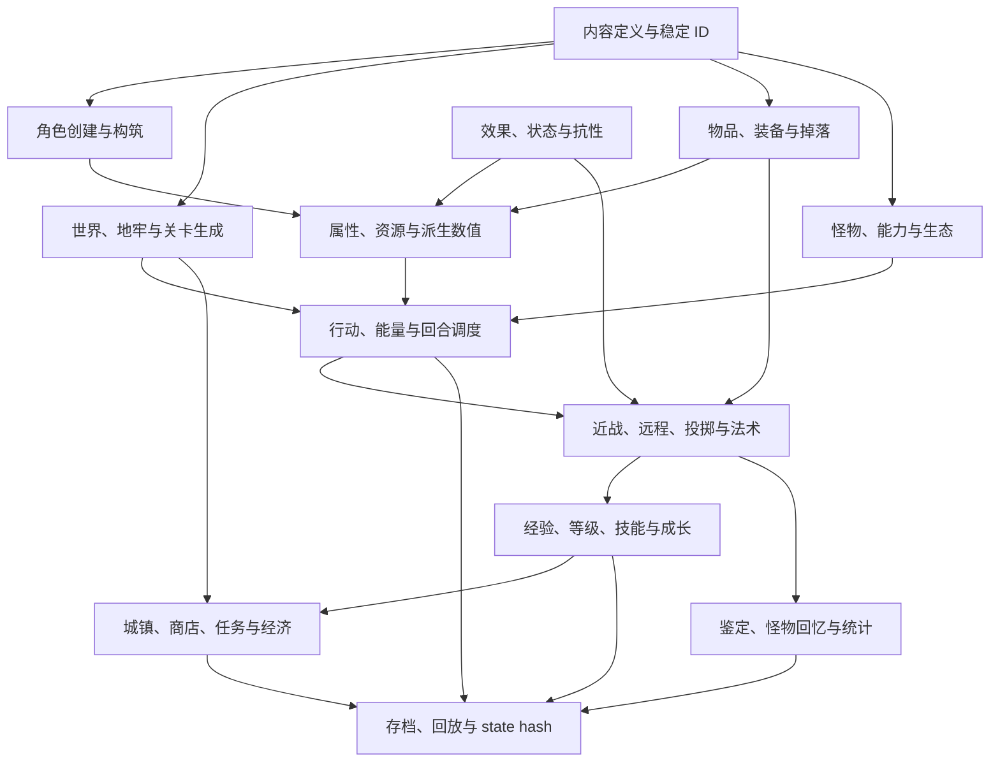

# RFB 全系统梳理与重构实现路线

状态：长期规则实现路线；当前基线为协议 1.55 / contract-v55

## 1. 目的与边界

本文把旧 RFB 1.3.0.7 的主要游戏系统重新整理为适合当前 Rust/Tauri 工程的领域边界、依赖顺序和验收里程碑。它不是旧 C 文件的移植清单，也不要求一次性复制全部内容。

执行边界：

- 旧仓库只用于只读分析规则、数据关系和行为，不复制旧代码、文本、地图、怪物、物品或素材进新仓库；
- 不读取旧 `localization/` 作为当前文本来源；玩家可见文本继续使用新仓库 Fluent 资源；
- 规则行为可以高保真复刻，C 结构体布局、数组下标、全局变量、`Term` 绘制和存档字段顺序不复刻；
- 当前内容包继续使用原创测试内容。若未来迁移旧内容，必须先单独完成许可证和内容审计，并通过显式内容转换流程；
- 每个系统进入主线前都必须拥有固定种子、contract fixture、存档回环和回放检查点。

## 2. 旧 RFB 的系统规模

旧工程约有 215 个 C 源文件和 30 万行以上代码。仅静态内容定义就大致包括：

| 内容类别 | 旧数据规模 | 主要来源 |
| --- | ---: | --- |
| 怪物种族 | 约 1396 条 | `r_info.txt`、`monster*.c`、`monspell.*` |
| 基础物品 | 约 545 条 | `k_info.txt`、`object*.c`、`obj*.c` |
| 固定神器 | 约 392 条 | `a_info.txt`、`artifact.c` |
| Ego/词条模板 | 约 160 条 | `e_info.txt`、`ego.c` |
| 地形特征 | 约 188 条 | `f_info.txt`、`cave.c`、`grid.c` |
| 地牢定义 | 约 44 条 | `d_info.txt`、`dungeon.c` |
| 任务定义 | 约 92 条、85 个任务地图文件 | `q_info.txt`、`q_*.txt`、`quest.c` |
| 建筑定义 | 约 113 条 | `b_info.txt`、`bldg.c` |
| 普通房间模板 | 约 278 条 | `rooms.txt`、`rooms.c` |
| Vault 模板 | 约 158 条 | `vaults.txt`、`rooms.c` |

源码中还存在约 68 个职业常量、80 余个玩家种族/怪物种族常量、19 个法术领域和大量职业专属资源、姿态、变身、宠物与成长机制。因此“先录入全部内容，再补规则”不可行；必须先建立能表达这些差异的公共规则能力。

## 3. 系统总图



依赖方向必须保持单向。UI、PixiJS 和 Tauri 只能消费协议 DTO 和事件，不能成为规则依赖。

## 4. 全系统清单与当前落地方式

状态含义：已建立、部分建立、未建立。

### 4.1 核心模拟与时间

| 子系统 | 旧 RFB 行为 | 当前状态 | 新实现方案 |
| --- | --- | --- | --- |
| 命令与行动 | 移动、等待、交互、物品、施法等命令消耗不同能量 | 已建立基础版 | `GameCommand → GameAction` 已统一当前行动成本；后续为免费取消、射击、施法和物品动作扩展各自成本与 outcome |
| 能量与速度 | 玩家和怪物使用速度表、`energy_need` 与多次行动 | 已建立基础版 | 原创整数分段曲线、固定实例 ID 顺序和标准成本 100 已进入协议、存档、回放与 state hash |
| 世界 tick | 每若干游戏回合处理饥饿、恢复、状态、城镇和职业回调 | 部分建立 | `worldTick`、稳定状态 phase、持续伤害、衰减、过期和死亡中断已建立；后续增加自然恢复、饥饿及世界级回调 |
| RNG | 多条规则共享全局随机数 | 已建立 | 保持单一权威 RNG；为每个抽取点定义稳定顺序和测试，不按系统创建隐式 RNG |
| 事件 | 旧版规则直接打印文本和设置 redraw 标志 | 已建立基础版 | 强类型 `DomainEvent` 已覆盖战斗、物品和状态生命周期；contract-v11 已让伤害/死亡事件携带完整结算 outcome，并建立结构化检定上下文与结果；下一步补充知识发现投影 |

### 4.2 地图、视野与关卡生命周期

| 子系统 | 旧 RFB 行为 | 当前状态 | 新实现方案 |
| --- | --- | --- | --- |
| 地形格 | 墙、地板、门、楼梯、陷阱、商店入口、任务入口等 | 部分建立 | contract-v28/v29 已建立普通门、锁门和破损状态，contract-v31 已建立秘密 terrain 真值、隐藏投影和发现知识；下一步增加隐藏陷阱 |
| 视野、记忆、光照 | LOS、FOV、探索记忆、怪物/物品光源 | 已建立基础版 | 保持 Rust 权威；后续增加隐身、黑暗、红外、感知和特殊视觉通道 |
| 交互地形 | 开门、关门、挖掘、撞门、解除陷阱、上/下楼 | 部分建立 | contract-v26 已建立楼梯，contract-v28–v30 已建立门与权威交互，contract-v31 已建立主动搜索；下一步建立陷阱触发与解除 |
| 楼层生命周期 | 新生成、离开、持久楼层、返回、任务楼层 | 已建立基础版 | contract-v26 已建立稳定 `FloorId`、显式 `FloorState`、离层仓库、save v1 往返和首次生成；后续增加多深度连接、临时/持久策略、任务层和旧层淘汰 |
| 地图生成 | 房间、走廊、vault、巢穴、主题、守护者、物品与怪物分配 | 部分建立 | contract-v26/v27 已建立双房间骨架与深度分配，contract-v46 已建立最终层和持久守护者，contract-v47–v50 已建立独立 Vault、楼层表、巢穴、actor/loot 总预算、深度主题、Vault 变换与空间预算，contract-v51 已建立动态群体，contract-v52 已建立 terrain feature 表及额外预算，contract-v53 建立 cavern/room 管线，contract-v54 建立 lake/river 水文，contract-v55 建立 maze/destroyed/streamer 与稳定回退；下一步补 pit/pack AI、多入口、完全替代房间的专用楼层模式和同层多区域主题 |

### 4.3 角色创建与身份

| 子系统 | 旧 RFB 行为 | 当前状态 | 新实现方案 |
| --- | --- | --- | --- |
| 出生流程 | 性别、种族、职业、性格、领域、子职业/子种族和初始装备 | 未建立 | `CharacterBuild` 草稿 DTO；核心验证可用组合，最终一次性生成角色，不让 UI 逐字段修改正式玩家状态 |
| 种族 | 属性、技能、生命、经验倍率、抗性、能力、装备模板和成长 | 未建立 | `RaceDefinition` + 可组合 trait；常规加成声明式，极特殊种族使用注册的 Rust 规则模块 |
| 职业 | 基础技能、成长、施法、装备限制、行动钩子和专属资源 | 未建立 | `ClassDefinition` + `RuleFeatureId[]`；禁止任意 `calc_bonuses` 回调写全局状态 |
| 性格 | 属性/技能修正和少量特殊行为 | 未建立 | 作为独立 `PersonalityDefinition` 修正层；幸运、懒惰等概率规则使用具名 rule feature |
| 怪物玩家种族 | 进化、天生攻击、特殊身体槽位、变身和独特施法 | 未建立 | 等普通角色、怪物身体、能力和装备模板稳定后再启用；不作为第一批内容 |

### 4.4 属性、资源与派生数值

| 子系统 | 旧 RFB 行为 | 当前状态 | 新实现方案 |
| --- | --- | --- | --- |
| 六维属性 | 力量、智力、智慧、敏捷、体质、魅力及损伤/恢复 | 未建立 | `AttributeSet` 保存自然值；装备、状态和形态仅提供 modifier，不覆盖基础值 |
| 生命/法力等资源 | HP、SP、生命倍率、职业特殊资源 | 部分建立 | 通用 `ResourcePool`，核心内置 HP/MP；怒气、专注、鲜血等通过稳定资源 ID 扩展 |
| 技能 | 近战、射击、投掷、潜行、感知、搜索、解除、设备等 | 未建立 | `SkillSet` 使用稳定 skill ID；等级成长通过曲线计算，不保存可重算的最终值 |
| 派生属性 | AC、速度、命中、伤害、攻击次数、抗性、感知等多来源叠加 | 已建立基础版 | `DerivedStatsPipeline` 已按基础 → 种族 → 职业 → 性格 → 装备 → 状态 → 姿态 → 环境排序并保留来源；当前覆盖最大生命、攻防、速度、近战能力、AC、攻击次数和近战伤害修正，后续扩展抗性和感知 |
| 装备限制 | 双持、双手、空手、护甲负重、施法妨碍、异形装备槽 | 部分建立 | `BodyPlan` + `EquipmentSlotRule` + `EncumbranceRule`，装备合法性和数值派生分开 |

### 4.5 状态、抗性与持续效果

| 子系统 | 旧 RFB 行为 | 当前状态 | 新实现方案 |
| --- | --- | --- | --- |
| 基础状态 | 加速、减速、失明、混乱、恐惧、中毒、流血、眩晕、麻痹等 | 部分建立 | `StatusInstance { kindId, intensity, remainingTicks, sourceId }`、三种叠加策略、加速/减速、毒、流血、眩晕和恐惧已进入存档/回放；后续补失明、混乱与麻痹 |
| 抗性 | 基础元素、高级元素、免疫、弱点、临时抗性 | 部分建立 | 稀疏 `ResistanceProfile` 和弱点/普通/抗性/强抗/免疫等级已建立；火焰近战已接入，其他元素等待实际规则入口和来源合并 |
| 增益与防御 | 祝福、英雄、护盾、无敌、反射、灵体等 | 未建立 | 通过 effect pipeline 改写命中、伤害或行动许可；优先组合拦截器，不在 `take_damage` 中持续加分支 |
| 饥饿与恢复 | 食物、自然回复、休息、环境伤害和周期性扣血 | 未建立 | 第一版可延后饥饿，但世界 tick、恢复和持续伤害接口必须先建立 |
| 变异与德行 | 永久/随机变异、德行变化及规则影响 | 未建立 | 变异作为持久 feature 集；德行作为具名整数 track。最后接入，避免污染基础角色模型 |

### 4.6 战斗

| 子系统 | 旧 RFB 行为 | 当前状态 | 新实现方案 |
| --- | --- | --- | --- |
| 玩家近战 | 命中、武器骰、攻击次数、暴击、斩味、品牌、克制、吸血等 | 部分建立 | contract-v12 已建立武器 `AttackProfile`、命中/伤害修正、稳定攻击次数与死亡中断；下一步增加 on-hit effect、暴击与品牌 |
| 怪物近战 | 最多四组 blow，每组包含方法和多个效果 | 部分建立 | contract-v13 已建立内容驱动的 `MeleeRoutine`、method ID、逐 blow 命中/伤害与死亡中断；下一步为 blow 增加 effect 列表和位移中断 |
| 射击 | 弓倍率、弹药、射程、命中、暴击、弹药破损与返回 | 部分建立 | contract-v17 与前端目标模式 v1 已建立稳定目标、弹药消费、内容驱动破损、权威落地回收和首目标碰撞；下一步增加职业修正、特殊返回、路径预览与动画 |
| 投掷 | 物品重量、投掷技能、返回武器和药水破裂 | 部分建立 | contract-v18 已建立内容驱动投掷 profile、整数重量射程、独立命中/伤害和单件实例落点；下一步增加返回武器、药水破裂、路径预览和动画 |
| 战斗特殊规则 | 反击、光环、背刺、姿态、骑乘、恐惧阻止攻击 | 部分建立 | 恐惧已通过行动检定阻止主动近战；其余规则使用明确的 combat phases 和 rule feature 优先级，禁止任意递归调用完整攻击命令 |
| 伤害与死亡 | 多种伤害类型、减伤、死亡原因、怪物击杀和掉落 | 部分建立 | `DamagePacket`、确定性抗性结算、物理 AC、元素伤害和状态死亡已建立；下一步统一 `DeathOutcome` 与伤害/抗性领域事件，供击杀、任务、经验和掉落订阅 |

### 4.7 法术、能力、设备与效果

| 子系统 | 旧 RFB 行为 | 当前状态 | 新实现方案 |
| --- | --- | --- | --- |
| 法术领域 | 生命、自然、混沌、死亡、恶魔、圣战、末日等 19 个领域 | 未建立 | `AbilityDefinition` 不直接绑定“法术书”；领域、职业能力、种族能力共用能力模型 |
| 学习与熟练 | 等级、法力、失败率、学习数量、熟练度和遗忘 | 未建立 | `AbilityBook` 保存已学能力和熟练；失败率由统一施法上下文计算 |
| 目标选择 | 自身、方向、格子、怪物、范围、投射、锥形等 | 部分建立 | contract-v16 已由核心声明方向/格子/实体 `TargetSpec` 并接收稳定 `TargetSelection`，前端目标模式 v1 已接入键盘准星和确认/取消；下一步扩展鼠标预览、自身、范围和锥形 |
| 效果执行 | 伤害、治疗、传送、召唤、侦测、地形改变、附魔等 | 已建立基础版 | `EffectSpec` 已支持伤害、治疗和状态添加/移除并返回结构化结果；传送、召唤、侦测、地形改变和附魔继续扩展同一组合器 |
| 消耗品 | 食物、药水、卷轴 | 部分建立 | contract-v21 已让 `UseAction` 引用首个治疗 effect，并在同一事务结算堆叠消耗、回合成本、结构化结果与可观察鉴定；后续增加状态、目标和多 effect 组合 |
| 魔杖/法杖/魔棒 | 设备难度、充能、SP、失败、词条和专精 | 未建立 | `DeviceState` 保存当前/最大能量和 effect；设备技能只进入统一失败率计算 |
| 装备激活 | 神器和装备的主动能力及冷却 | 未建立 | 装备实例保存 cooldown；激活本身仍是 ability/effect，不创建第二套施法系统 |

### 4.8 物品、装备、掉落与知识

| 子系统 | 旧 RFB 行为 | 当前状态 | 新实现方案 |
| --- | --- | --- | --- |
| 背包与地面堆 | 堆叠、拆分、容量、溢出、拾取、丢弃 | 已建立基础版 | contract-v19 已建立背包/装备总重、内容容量和整堆拾取原子拒绝；后续增加容器、槽位容量和负重分级，保持实例 ID 不复用 |
| 装备 | 多槽位、身体模板、双持/双手、箭袋、负重 | 部分建立 | `BodyPlan` 决定槽位；箭袋和特殊包作为容器组件，不在装备代码硬编码 |
| 物品生成 | 基础种类、等级、质量、随机加值、稀有度和掉落主题 | 已建立基础版 | contract-v24 已建立 `LootContext`、加权物品/品质/词条表和每 roll 固定三次 RNG；后续增加深度、区域主题、稀有度和 unique 过滤 |
| Ego、神器与随机神器 | 模板词条、固定神器、随机能力、诅咒和重铸 | 部分建立 | contract-v22 已建立基础物品与实例 affix 分层；后续增加 unique、诅咒与随机能力，随机神器保存生成结果，不依赖未来内容表重算 |
| 鉴定与感知 | aware、tried、伪鉴定、已知 flag、诅咒发现 | 部分建立 | contract-v23 已建立 unexamined/appraised/identified：鉴别只公开质量，装备公开完整词条；后续扩展鉴定来源与诅咒知识 |
| 词条学习 | 使用或受击后发现抗性、克制、激活等 | 部分建立 | contract-v22 已以首次装备产生稳定发现事件并保存实例知识；后续扩展到使用、受击与逐项发现 |
| 自动拾取与铭文 | 条件匹配、自动鉴定、销毁、拾取和铭文 | 未建立 | 后期实现结构化规则 AST 和可视化编辑器；不继续使用依赖本地化名称的文本匹配 |
| 锻造、炼金与重铸 | 附魔、品牌、打造、材料和神器重铸 | 未建立 | 在物品实例/affix/能力系统稳定后实现，作为服务或职业能力调用同一物品变换 API |

### 4.9 怪物、AI 与生态

| 子系统 | 旧 RFB 行为 | 当前状态 | 新实现方案 |
| --- | --- | --- | --- |
| 怪物定义 | HP、AC、速度、经验、抗性、blow、法术、掉落、标签 | 部分建立 | 扩展 `ActorDefinition` 为角色公共部分 + `MonsterDefinition`，避免玩家和怪物字段无限并集 |
| 回合与移动 AI | 追踪、视线、气味/flow、保持距离、逃跑、守卫、射击 | 部分建立 | contract-v8 已有八方向 BFS 追踪、占位避让和确定性 tie-breaker；后续以 `AiIntent` 扩展视线、距离、逃跑和能力选择 |
| 怪物施法 | 选择法术、频率、射线检查、召唤和智能学习 | 未建立 | 能力系统共用 effect；AI 仅从可用能力评分，不直接执行效果 |
| 群体与生成 | 成群、护卫、朋友、召唤、繁殖、独特和守护者 | 已建立基础版 | contract-v47 的 Vault 固定群体、contract-v48 的同类巢穴和 contract-v51 的动态 friends/escort、`cluster/ring` formation 与群体预算已建立；后续增加 pit、任意形状/散布、pack AI、召唤、繁殖、唯一性和种群上限 |
| 怪物物品与掉落 | 携带物、偷窃、掉落次数和主题 | 已建立基础版 | contract-v25 已建立真实携带实例、出生生成和统一死亡掉落事务；后续增加偷窃、缴械、怪物拾物、掉落次数和主题 |
| 怪物回忆 | 观察攻击、抗性、掉落、击杀次数和死亡次数 | 未建立 | `MonsterKnowledge` 与怪物定义分开；观察事件逐项揭示 |
| 宠物/友好 | 阵营、跟随、命令、维持费用、解散 | 未建立 | `FactionId` + `CompanionState` + 宠物命令；不使用多个 pet/friendly bool 组合 |
| 骑乘与捕获 | 坐骑、骑术、落马、捕获球和宠物成长 | 未建立 | 等身体、移动、宠物和容器完成后实现；属于高级系统 |
| 进化/变形/附身 | 怪物进化、玩家怪物种族、Possessor、Mimic | 未建立 | 使用 `FormDefinition` 和显式状态迁移；最后阶段实现 |

### 4.10 成长、经验与构筑

| 子系统 | 旧 RFB 行为 | 当前状态 | 新实现方案 |
| --- | --- | --- | --- |
| 经验与等级 | 击杀经验、经验倍率、等级升降、最高等级 | 未建立 | `ProgressionTrack`；升级产生事件，派生属性重算但不直接修改装备/内容 |
| HP 成长 | 种族、职业、生命倍率和随机成长 | 未建立 | 出生时生成并保存 HP 成长序列，保证存档和回放稳定 |
| 技能熟练 | 武器、射击、法术、骑术等熟练度 | 未建立 | 稳定 skill/proficiency ID；每次增长有上限和来源事件 |
| 职业专属成长 | 技能点、契约、姿态、领域选择、进化树 | 未建立 | 通用 `ChoiceGrant` 与 `ProgressionNode`；特别复杂职业可有自己的小型状态组件 |
| 声望、金钱、德行 | 商店价格、任务奖励、建筑服务和特殊职业资源 | 仅金钱未建立 | 分成经济、声望、德行三个明确系统，禁止复用一个字段表达不同语义 |

### 4.11 城镇、荒野、地牢、商店与任务

| 子系统 | 旧 RFB 行为 | 当前状态 | 新实现方案 |
| --- | --- | --- | --- |
| 多地牢 | 深度范围、守护者、主题、进入条件和特殊规则 | 未建立 | `DungeonDefinition` + `DungeonRunState`；楼层生成引用 encounter/loot/theme 表 |
| 荒野 | 大地图、地形、生物群落、城镇入口和旅行 | 未建立 | 桌面版后期实现分区世界图；不与当前战术格地图共用同一尺寸假设 |
| 城镇 | 多城镇、访问状态、地图、昼夜和服务 | 未建立 | `TownDefinition`，城镇地图仍走普通 map/floor 系统 |
| 商店与家 | 库存刷新、买卖、鉴定价格、黑市、家中仓库 | 未建立 | 商店是持久 inventory + pricing policy；交易作为原子命令；家是无价格仓库 |
| 建筑服务 | 治疗、鉴定、附魔、重铸、任务、公会等 | 未建立 | `ServiceDefinition` 引用 effect/transaction；UI 根据服务 schema 生成表单 |
| 任务 | 接取、进行、完成、失败、奖励、杀敌/寻物/清层目标 | 未建立 | `QuestStateMachine` + 可组合目标；任务只监听领域事件，不侵入战斗和拾取代码 |
| 竞技场/特殊模式 | 单挑、押注、特殊胜负与奖励 | 未建立 | 使用独立 scenario/floor ruleset；在任务和关卡规则稳定后实现 |
| 最终胜利 | 守护者、最终首领、胜利状态、退休和分数 | 未建立 | `CampaignState` 监听关键任务/击杀事件；不在怪物死亡函数硬编码 |

### 4.12 自动化、信息和元系统

| 子系统 | 旧 RFB 行为 | 当前状态 | 新实现方案 |
| --- | --- | --- | --- |
| 运行/休息/旅行 | 连续移动、自动探索、最近目标、休息至恢复 | 仅单步移动/等待 | 前端可发起高层命令，但核心逐行动执行并允许危险中断；回放记录实际命令或确定性宏命令 |
| 观察与目标 | look、target、怪物/物品列表、路径和范围 | 未建立 | 核心提供只读 query/preview；选择本身是 UI 状态，确认目标才成为命令 |
| 知识菜单 | 怪物、物品、神器、ego、地形、地牢、宠物、统计 | 未建立 | HTML 分页/搜索界面读取知识 DTO；不复刻终端文档窗口 |
| 消息、笔记和角色档案 | 消息历史、自动笔记、截图、角色 dump | 消息基础版 | 结构化事件生成可本地化历史；角色档案导出 Markdown/HTML，不混入地图渲染 |
| 选项和键位 | 大量规则/显示选项、宏和 keymap | 部分建立 | 规则选项进入核心存档并版本化；显示/键位保存在前端；宏改为结构化动作绑定 |
| 分数和统计 | 高分、击杀、物品来源、施法统计、胜利记录 | 未建立 | `RunStatistics` 由事件投影生成；排行榜若联网必须是独立可选服务 |
| 存档、回放、崩溃诊断 | 旧结构体顺序存档、屏幕 dump | 已建立新框架 | 延续版本化 MessagePack、迁移链、回放和自动本地诊断 |
| 本地化和渲染 | 硬编码文本、Term 字符/颜色混合 | 已建立新框架 | 继续 Fluent + 语义地图 + PixiJS/HTML 分层，不退回旧显示模型 |

## 5. 目标代码结构

当前 `rfb-core/src/lib.rs` 已超过 2200 行。在继续扩展规则前，先拆成内部模块；暂不为每个系统建立独立 crate，等边界稳定后再考虑抽取。

```text
crates/rfb-core/src/
  lib.rs                 对外入口与兼容 re-export
  game.rs                Game 聚合根、创建/载入/快照
  command.rs             命令验证与意图转换
  turn/
    scheduler.rs         能量、速度、行动顺序
    phases.rs            回合结束和世界 tick
  actor/
    state.rs             玩家/怪物公共运行状态
    resources.rs         HP、MP 和扩展资源
    stats.rs             基础与派生属性
    status.rs            状态实例与持续时间
  effect/
    spec.rs              声明式 effect 定义
    executor.rs          效果执行和事务
    resistance.rs        抗性与伤害变换
  combat/
    melee.rs
    projectile.rs
    damage.rs
    death.rs
  item/
    instance.rs
    inventory.rs
    equipment.rs
    knowledge.rs
    loot.rs
  monster/
    ai.rs
    spawn.rs
    lore.rs
    companion.rs
  map/
    floor.rs
    terrain.rs
    interaction.rs
    generation.rs
  progression/
    level.rs
    proficiency.rs
    build.rs
  ability/
    state.rs
    targeting.rs
    casting.rs
  world/
    dungeon.rs
    town.rs
    shop.rs
    quest.rs
  knowledge.rs
  statistics.rs
```

`rfb-content` 相应增加独立定义文件：`race`、`class`、`personality`、`ability`、`effect`、`monster`、`loot-table`、`room-template`、`dungeon`、`town`、`shop` 和 `quest`。编译后的 `.rfbcontent` 继续建立稳定索引，但运行时和存档只通过字符串 ID 关联。

## 6. 四个必须先完成的公共底座

### 6.1 行动与能量调度器

所有移动、攻击、交互、施法、物品和怪物行为都必须成为 `GameAction`。调度器统一负责：

- 行动能量成本；
- 速度带来的行动频率；
- 玩家与多个怪物的稳定行动顺序；
- 行动前置条件和取消；
- 行动后状态 tick、死亡处理和世界 tick；
- 回放所需 RNG draw counter 和事件顺序。

没有这一层，怪物 AI、加速/减速、多次攻击和自动探索都会产生互相冲突的回合规则。

### 6.2 效果与伤害管线

建立少量可组合原语：伤害、治疗、资源变化、添加状态、移除状态、位移、传送、召唤、生成物品、改变地形、侦测和知识揭示。法术、设备、消耗品、陷阱、怪物 blow 和建筑服务都调用同一管线。

效果执行必须返回结构化结果，不能直接修改 UI 或拼接文本。

### 6.3 派生属性与来源追踪

最终 AC、命中、伤害、速度、攻击次数、抗性和施法失败率由多个来源叠加。新核心应输出：

```text
最终值 = 基础 + 种族 + 职业 + 性格 + 装备 + 状态 + 姿态 + 环境
```

每项 modifier 带来源 ID、叠加规则和优先级。这样人物面板可以解释“为什么是这个数值”，也避免修改 `player_type` 式巨型缓存。

### 6.4 真实状态与知识状态分离

怪物抗性、物品词条和陷阱位置属于真实世界；玩家是否知道它们属于知识状态。协议只向普通 UI 暴露玩家可知视图，调试接口另行授权。该边界必须在批量加入物品和怪物前完成，否则后续很难补上鉴定与怪物回忆。

## 7. 分阶段实施路线

每个阶段都新建 contract 版本；版本号仅在权威 DTO、内容 hash 或 state hash 发生变化时提升。

### 阶段 A：核心模块化与行动调度

目标：把当前可玩切片迁入模块化结构，并加入真正的速度/能量回合。

当前进度：阶段 A 已完成。前置重构拆分了 `rfb-core` 游戏聚合、运行状态、RNG、战斗公式、事件构造、存档转换和错误模块；存档使用独立权威 DTO，物品运行状态统一为 `ItemInstance + ItemLocation`，规则事件使用强类型 `DomainEvent`。contract-v8 进一步加入 `GameAction`、标准成本 100、原创确定性速度曲线、`worldTick`、玩家/怪物剩余能量、稳定实例 ID 调度、八方向 BFS 追踪、占位避让和玩家死亡后的队列中止，并通过 Schema v8、32 个 exact fixtures、存档回环及 10,000 命令回放固定行为。

实现：

- 拆分 `rfb-core` 单文件，不改变现有 v7 行为；
- `GameAction`、能量成本、玩家/怪物调度和稳定顺序；
- 怪物基础追踪、相邻攻击、被阻挡时的确定性选择；
- 行动阶段事件和死亡中断；
- 存档、回放和 10,000 回合调度无漂移测试。

验收场景：普通速度一对一追逐、快/慢怪物、多怪物争用通道、玩家死亡后队列立即停止。

### 阶段 B：状态、抗性和效果管线

目标：让战斗、物品和法术共享规则原语。

当前进度：阶段 B 的基础伤害、抗性、效果与检定原语已足以承载普通战斗纵切；contract-v21 已复用 `EffectSpec::Heal` 完成首个消耗品，contract-v29/v31 又复用结构化 check 完成门与搜索检定。当前 active baseline 已进入阶段 E 的 contract-v31，阶段 B 后续只按实际规则入口补充新的状态、抗性和效果。

首批内容：毒、流血、眩晕、恐惧、加速、减速；火、冷、电、酸、毒抗性；治疗、传送、侦测。

验收场景：状态叠加/覆盖、回合衰减、抗性等级、持续伤害致死、保存重载后时序一致。

### 阶段 C：完整基础战斗

目标：覆盖普通职业所需的近战、射击和投掷。

当前进度：普通近战、怪物多 blow、射击和投掷四条基础纵切均已接入统一检定、`DamagePacket`、事件、存档与回放闭环。职业修正、暴击、品牌、返回武器、消耗品破裂和表现层预览按实际内容需求继续补充；主推进方向转入阶段 D 的物品重量与容量。

实现：

- 武器 `toHit`、`toDamage`、武器骰、攻击次数和双手/双持框架；
- 怪物多 blow 数据模型；
- 暴击接口、克制/品牌接口、吸血和 on-hit effect；
- projectile、射程、弹药、落点和目标选择；
- 反击、光环和击退使用受控 combat phase。

暂不一次实现所有特殊职业攻击，只用原创武器、弓、投掷物和 3–5 种怪物验证框架。

### 阶段 D：物品、装备、鉴定和掉落

目标：建立可以承载 RFB 装备构筑的物品闭环。

当前进度：阶段 D 已由 contract-v25 完成怪物真实携带物、出生生成、隐藏所有权、save v1 携带列表和统一死亡掉落事务；contract-v24 的普通死亡生成继续作为独立阶段。详细边界见 [Contract v25](contract-v25-monster-carried-items.md)。

实现：

- 重量、容量、身体槽位、双手、箭袋和负重；
- 基础物品、affix、固定 unique、诅咒和激活；
- aware/tried/伪鉴定/完整鉴定和词条逐项发现；
- 按深度和主题的掉落表；
- 地面堆、怪物携带物和死亡掉落。

验收场景：未知药水、未知装备、发现抗性、诅咒限制卸下、固定种子 loot、存档后知识不泄漏。

### 阶段 E：楼层、地牢生成和探索闭环

目标：从固定 20×20 地图升级为可连续游玩的地牢。

当前进度：contract-v26–v35 已建立楼层生命周期、程序化房间、权威 terrain 交互、多深度连接和离开后清除的探索实例；contract-v46 已建立最终层与持久守护者；contract-v47–v50 已建立独立 Vault、楼层级 encounter/loot/theme 表、加权选择、第一类同类巢穴、actor/loot 总预算、两段深度主题、十层压力地牢以及 Vault 空间管线；contract-v51 建立动态 friends/escort formation 与群体预算；contract-v52 新增 terrain feature 表与额外预算；contract-v53 建立 cavern/room 分阶段管线；contract-v54 新增深浅 lake/river；contract-v55 参考 `build_maze_vault()`、`destroy_level()` 与 `build_streamer()` 新增完美 maze、多震中 destroyed、加权 streamer、独立废墟/矿脉 terrain 和稳定墙体回退。内容包为 1.48.0，active baseline 共 110 个 exact fixtures，save v1 / state hash Schema v19。下一切片应推进 pit/pack AI、多入口、完全替代房间的专用楼层模式和同层多区域主题。详细边界见 [Contract v55](contract-v55-maze-destroyed-streamers.md)。

实现：

- 门、楼梯、陷阱、搜索、开关门、解除和挖掘；
- 楼层切换、楼层 ID、返回和持久层；
- 房间/走廊、连通性、怪物/物品分配；
- 运行、休息、自动探索和危险中断；
- 第一座原创 10 层测试地牢和守护者。

### 阶段 F：角色创建、成长与普通职业模板

目标：完成一局从出生到升级的角色循环。

实现：

- 六维属性、经验、等级、HP 成长、技能和熟练度；
- Race/Class/Personality 内容 schema；
- 出生 UI、初始装备和可选能力；
- 第一批代表性构筑：纯近战、书本施法、混合远程、设备使用者。

不要立即录入几十个职业；先证明四种规则原型可以只靠公共能力实现。

### 阶段 G：能力、法术、设备和消耗品

目标：统一主动能力生态。

实现：

- 能力学习、资源、失败率、熟练和冷却；
- 自身/方向/实体/格子/区域目标；
- 食物、药水、卷轴、魔杖、法杖、魔棒和装备激活；
- 第一批原创法术领域，覆盖伤害、治疗、位移、召唤、侦测和地形改变。

之后再按机制簇迁移领域，而不是按旧文件顺序逐本法术书迁移。

### 阶段 H：怪物 AI、法术、生态与回忆

目标：支持接近旧 RFB 的怪物差异。

实现顺序：

1. 追踪、逃跑、保持距离和守卫；
2. 远程/法术评分、射线和召唤；
3. 群体、护卫、繁殖、独特和守护者；
4. 掉落主题、怪物携带物；
5. 怪物回忆和智能学习；
6. 友好、宠物和命令。

骑乘、捕获、进化、附身和玩家怪物种族延后到普通怪物系统稳定之后。

### 阶段 I：城镇、商店、任务与经济

目标：建立地牢外长期循环。

实现：城镇地图、商店刷新、交易、家中仓库、建筑服务、任务状态机、奖励、声望和第一条原创主线。任务目标只订阅击杀、拾取、进入楼层等领域事件。

当前进度：contract-v36–v45 已建立一次性/可重接任务层、收集与击杀目标、奖励日志、主动放弃、计数进度、暂停恢复、共享任务 ID、权威 `TaskState`、集中领域事件订阅和跨成员楼层的有序多阶段目标。下一步建立暂停任务的地表管理；城镇、商店、接取来源、超时、脚本与声望仍未实现。

### 阶段 J：荒野、多地牢与战役

目标：连接多个城镇和地牢。

实现：世界分区、旅行、遭遇、多地牢进入条件、最终守护者、胜利状态和角色退休。竞技场和特殊场景使用同一 floor/scenario ruleset。

### 阶段 K：高级职业、种族和特殊机制

按底层机制而非旧源码文件推进：

- 姿态与武技：武士、武僧、神秘者类；
- 契约与宠物：术士、驯兽师类；
- 设备/吞噬/复制能力：设备专家、魔法吞噬类；
- 变身与身体：拟态、吸血鬼、狼人；
- 怪物成长：龙、元素、巨人等玩家怪物种族；
- 附身与非常规装备：Possessor、Ring、Living Sword；
- 自定义成长树：Skillmaster 等。

每类先实现一个代表，再扩展同机制内容。

### 阶段 L：自动化、知识库和完整元系统

实现自动拾取规则 AST、自动铭文、宏/动作绑定、完整知识菜单、怪物回忆、统计、角色档案、高分、胜利记录和可选 spoiler 工具。最后进行大规模内容录入、性能分析、平衡差分和发行准备。

## 8. 最近三次迭代的具体建议

当前最合适的执行顺序：

1. **contract-v11：继续完成阶段 B 与检定接口（已完成）**
   - 已完成：伤害类型、抗性结果和死亡结算进入强类型领域/协议事件；
   - 已完成：为酸、电、冷、毒增加原创怪物近战入口；
   - 已完成：建立带来源的派生属性与基础检定管线；
   - 已完成：在检定接口上实现眩晕能力削弱和恐惧行动限制。
2. **contract-v12：武器与多 blow 战斗**
   - 已完成：统一 `AttackProfile` 与武器实例命中、伤害和骰子；
   - 已完成：玩家攻击次数和稳定中断顺序；
   - 已由 contract-v13 完成：怪物 `MeleeRoutine` / blow 列表；
   - `DeathOutcome`、死亡/掉落订阅边界和 on-hit effect。
3. **contract-v14–v18：射击、投掷与 projectile（已完成基础纵切）**
   - 已完成：方向、射程、轨迹、碰撞点和可放置落点；
   - 已完成：发射器 profile、稳定弹药引用/消费与投掷实例拆分；
   - 已完成：核心方向/格子/实体目标规格、稳定选择与非八方向整数轨迹；
   - 已完成：前端键盘/按钮目标模式、稳定实体/格子选择和相机同步准星；
   - 已完成：内容驱动的弹药破损、无碰撞回收和持久化地面实例；
   - 已完成：投掷攻击 profile、整数重量射程、独立命中/伤害和持久化落点；
   - 射击与投掷均已复用既有 `DamagePacket` / effect pipeline；
   - 延后：返回武器、药水破裂、鼠标预览和动画事件。

阶段 D 已由 contract-v25 完成背包重量/容量、种类级 aware/tried、消耗品、实例词条、鉴别状态机、确定性死亡掉落和怪物真实携带物。阶段 E 的 contract-v26–v35 已完成楼层生命周期、程序化内容、门、秘密地形、陷阱、挖掘、多深度楼层和离开后重置的地牢探索实例，contract-v46 完成最终层和持久守护者，contract-v47 完成第一类深度主题 Vault、固定群体和专属 loot，contract-v48 完成楼层级 encounter/loot/theme 表、Vault 加权选择、回退与首类巢穴，contract-v49 完成十层压力场景、actor/loot 预算和深度区域主题，contract-v50 完成 Vault 变换、自由落位、多模板空间预算与失败回退，contract-v51 完成动态群体，contract-v52 完成 terrain feature 表和额外特殊地形预算，contract-v53 完成 cavern/room 几何预算，contract-v54 完成 lake/river，contract-v55 完成 maze/destroyed/streamer；下一步扩展 pit/pack AI、多入口、专用楼层模式和多区域主题。阶段 I 已由 contract-v36–v45 建立任务层、目标、奖励、退出政策、暂停恢复、共享任务 ID、权威任务状态机和有序多阶段目标。

## 9. 内容迁移策略

### 9.1 当前阶段

- 新仓库只提交原创内容和中性机制 fixtures；
- 旧 `lib/edit` 数据只能由本地工具读取并输出统计、字段映射和行为报告到 `.local/`；
- 不把旧怪物名称、描述、任务地图或物品表作为测试 fixture 提交。

### 9.2 未来可能的内容包

如果许可证审计允许，可建立独立、可选的兼容内容包工程。转换流程必须：

1. 解析旧定义；
2. 映射到稳定字符串 ID；
3. 生成转换报告和未支持字段列表；
4. 由人工确认文本、素材和规则授权；
5. 编译成 `.rfbcontent`；
6. 与核心代码和原创素材许可证保持分离。

规则核心不能依赖该兼容包才能启动或测试。

## 10. 测试与验收体系

每个系统至少使用以下测试层：

- 单元测试：公式、叠加顺序、上限、边界和错误；
- property test：库存守恒、伤害不变量、地图连通性、任务状态合法转换；
- contract fixtures：完整命令流、事件顺序、最终状态和 state hash；
- 存档迁移：缺失字段、旧内容 hash、保存—载入—继续执行；
- 回放：RNG draw counter 和长回合无漂移；
- 前端测试：协议消费、知识隐藏、本地化变量和操作禁用；
- Tauri E2E：玩家实际完成该系统的一段流程；
- 本地旧版差分：只在 `.local/` 运行，不把旧内容复制到公共 fixture。

任何系统若无法回答“权威状态保存在哪里、RNG 何时抽取、事件顺序是什么、UI 能看到什么”，就不应进入内容扩充阶段。

## 11. 完成标准

“系统已实现”必须同时满足：

- 有稳定内容 schema 或明确 Rust 规则接口；
- 有权威运行状态和不变量验证；
- 可保存、载入、回放并跨平台得到一致 state hash；
- 玩家可见文本全部通过 Fluent；
- 地图变化通过语义 delta，菜单和说明使用 HTML UI；
- 至少一个原创可玩场景覆盖正常、失败和边界路径；
- 规划文档记录与旧 RFB 的已知差异和暂缓内容。

按此标准推进后，项目会先形成一个规则架构完整、内容较少但可持续扩展的游戏，再逐步扩大到 RFB 的职业、种族、怪物、物品、地牢和任务规模。
