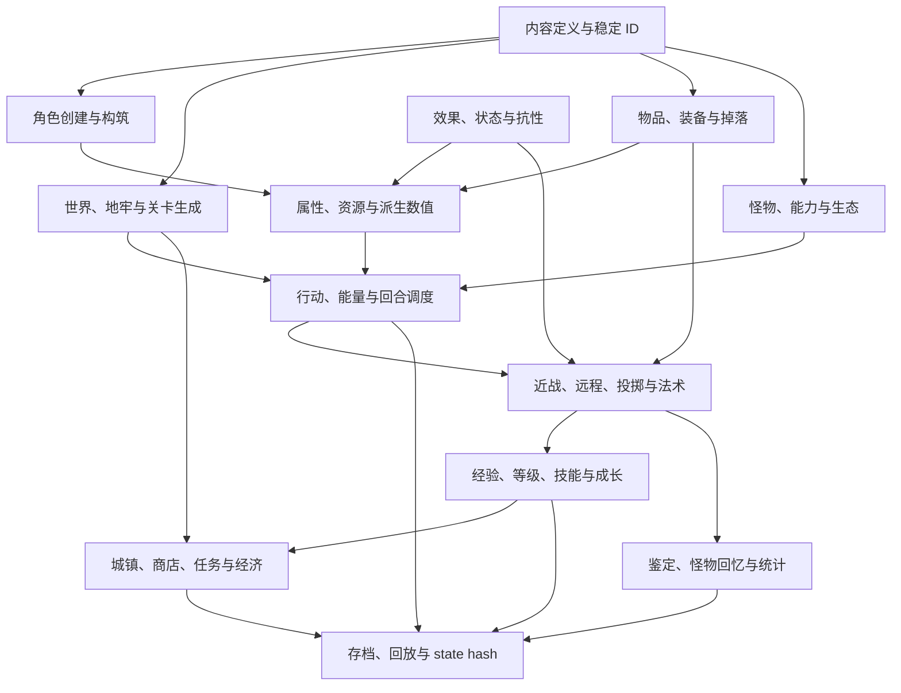

# RFB 全系统梳理与重构实现路线

状态：长期规则实现路线；当前基线为协议 1.135 / contract-v169（P31–P98 进展见 8.3，玩家流程与 Outpost 进展见 Phase 17/18，物品接入见 Phase 19）

## 1. 目的与边界

本文把旧 RFB 1.3.0.7 的主要游戏系统重新整理为适合当前 Rust/Tauri 工程的领域边界、依赖顺序和验收里程碑。它不是旧 C 文件的移植清单，也不要求一次性复制全部内容。

执行边界：

- 旧仓库只用于只读分析规则、数据关系和行为，不复制旧代码、文本、地图、怪物、物品或素材进新仓库；
- 不读取旧 `localization/` 作为当前文本来源；玩家可见文本继续使用新仓库 Fluent 资源；
- 规则行为可以高保真复刻，C 结构体布局、数组下标、全局变量、`Term` 绘制和存档字段顺序不复刻；
- 当前内容包继续使用原创测试内容。若未来迁移旧内容，必须先单独完成许可证和内容审计，并通过显式内容转换流程；
- 每个系统进入主线前都必须拥有固定种子、contract fixture、存档回环和回放检查点。

当前阶段定位：截至 contract-v90，重构已经形成确定性、可存档、可回放并可持续扩展的规则引擎，阶段 E 的地牢生成与探索闭环达到阶段性里程碑，阶段 F/G 已建立原版式角色成长、构筑、首轮技能检定、玩家 Mana、能力书、目标施法及伤害/治疗/位移/召唤/侦测/地形/状态效果的首轮纵切，并以 contract-v90 建立多职业资源底子与首个技法资源；阶段 H 已建立怪物百分比施法、效用权重、阵营目标、多格结算、敌对召唤、保持距离/受伤撤退、smart 抗性观察，以及玩家召唤物的行动/命令闭环。项目尚未达到旧 RFB 的完整职业矩阵、法术广度、怪物生态、世界经济或内容规模。

## 2. 旧 RFB 的系统规模

旧工程约有 215 个 C 源文件和 30 万行以上代码。仅静态内容定义就大致包括：

| 内容类别 | 旧数据规模 | 主要来源 |
| --- | ---: | --- |
| 怪物种族 | 约 1396 条 | `r_info.txt`、`monster*.c`、`monspell.*` |
| 基础物品 | 约 545 条 | `k_info.txt`、`object*.c`、`obj*.c` |
| 固定神器 | 约 392 条 | `a_info.txt`、`artifact.c` |
| Ego/词条模板 | 约 160 条 | `e_info.txt`、`ego.c` |
| 地形特征 | 约 188 条 | `f_info.txt`、`cave.c`、`grid.c` |
| 地牢定义 | 约 44 条 | `d_info.txt`、`dungeon.c` |
| 任务定义 | 约 92 条、85 个任务地图文件 | `q_info.txt`、`q_*.txt`、`quest.c` |
| 建筑定义 | 约 113 条 | `b_info.txt`、`bldg.c` |
| 普通房间模板 | 约 278 条 | `rooms.txt`、`rooms.c` |
| Vault 模板 | 约 158 条 | `vaults.txt`、`rooms.c` |

源码中还存在约 68 个职业常量、80 余个玩家种族/怪物种族常量、19 个法术领域和大量职业专属资源、姿态、变身、宠物与成长机制。因此“先录入全部内容，再补规则”不可行；必须先建立能表达这些差异的公共规则能力。

## 3. 系统总图


```mermaid
flowchart TD
    Content["内容定义与稳定 ID"] --> Creation["角色创建与构筑"]
    Content --> World["世界、地牢与关卡生成"]
    Content --> Items["物品、装备与掉落"]
    Content --> Monsters["怪物、能力与生态"]

    Creation --> Stats["属性、资源与派生数值"]
    Items --> Stats
    Status["效果、状态与抗性"] --> Stats

    Stats --> Actions["行动、能量与回合调度"]
    World --> Actions
    Monsters --> Actions
    Actions --> Combat["近战、远程、投掷与法术"]
    Status --> Combat
    Items --> Combat

    Combat --> Progress["经验、等级、技能与成长"]
    Combat --> Knowledge["鉴定、怪物回忆与统计"]
    World --> Quests["城镇、商店、任务与经济"]
    Progress --> Quests

    Actions --> Save["存档、回放与 state hash"]
    Progress --> Save
    Knowledge --> Save
    Quests --> Save
```

依赖方向必须保持单向。UI、PixiJS 和 Tauri 只能消费协议 DTO 和事件，不能成为规则依赖。

## 4. 全系统清单与当前落地方式

状态含义：已建立、部分建立、未建立。

### 4.1 核心模拟与时间

| 子系统 | 旧 RFB 行为 | 当前状态 | 新实现方案 |
| --- | --- | --- | --- |
| 命令与行动 | 移动、等待、交互、物品、施法等命令消耗不同能量 | 已建立基础版 | `GameCommand → GameAction` 已统一当前行动成本；后续为免费取消、射击、施法和物品动作扩展各自成本与 outcome |
| 能量与速度 | 玩家和怪物使用速度表、`energy_need` 与多次行动 | 已建立基础版 | 原创整数分段曲线、固定实例 ID 顺序和标准成本 100 已进入协议、存档、回放与 state hash |
| 世界 tick | 每若干游戏回合处理饥饿、恢复、状态、城镇和职业回调 | 部分建立 | `worldTick`、稳定状态 phase、持续伤害、衰减、过期和死亡中断已建立；contract-v74/v75 让等待/休息恢复和能力冷却复用真实调度，后续增加 HP 自然恢复、饥饿及世界级回调 |
| RNG | 多条规则共享全局随机数 | 已建立 | 保持单一权威 RNG；为每个抽取点定义稳定顺序和测试，不按系统创建隐式 RNG |
| 事件 | 旧版规则直接打印文本和设置 redraw 标志 | 已建立基础版 | 强类型 `DomainEvent` 已覆盖战斗、物品、状态、技能、学习、施法与休息生命周期；contract-v11 建立伤害/死亡 outcome，contract-v72 建立结构化 check outcome，contract-v73 建立 ability-cast，contract-v74 建立 resource-recovery/rest outcome，contract-v75 扩展能力进度/冷却字段 |

### 4.2 地图、视野与关卡生命周期

| 子系统 | 旧 RFB 行为 | 当前状态 | 新实现方案 |
| --- | --- | --- | --- |
| 地形格 | 墙、地板、门、楼梯、陷阱、商店入口、任务入口等 | 部分建立 | contract-v28/v29 已建立普通门、锁门和破损状态，contract-v31 已建立秘密 terrain 真值、隐藏投影和发现知识；下一步增加隐藏陷阱 |
| 视野、记忆、光照 | LOS、FOV、探索记忆、怪物/物品光源 | Phase 18 Gate 3 已建立燃料光源 | contract-v159 让地表环境光与地牢暗视野分离，并以火把/灯笼实例燃料控制半径 1/2 的当前可见区；后续增加隐身、红外、感知、永久光和特殊视觉通道 |
| 交互地形 | 开门、关门、挖掘、撞门、解除陷阱、上/下楼 | 部分建立 | contract-v26 已建立楼梯，contract-v28–v30 已建立门与权威交互，contract-v31 已建立主动搜索；下一步建立陷阱触发与解除 |
| 楼层生命周期 | 新生成、离开、持久楼层、返回、任务楼层 | 已建立基础版 | contract-v26 已建立稳定 `FloorId`、显式 `FloorState`、离层仓库、save v1 往返和首次生成；后续增加多深度连接、临时/持久策略、任务层和旧层淘汰 |
| 地图生成 | 房间、走廊、vault、巢穴、主题、守护者、物品与怪物分配 | 部分建立 | contract-v26/v27 已建立双房间骨架与深度分配，contract-v46 已建立最终层和持久守护者，contract-v47–v50 已建立独立 Vault、楼层表、巢穴、actor/loot 总预算、深度主题、Vault 变换与空间预算，contract-v51 已建立动态群体，contract-v52 已建立 terrain feature 表及额外预算，contract-v53–v55 建立 cavern/lake/river/maze/destroyed/streamer 管线，contract-v56 建立原版式复合 pit 与等级阵列，contract-v57 建立完全替代 rooms 的 maze-only 专用楼层，contract-v58 建立多楼梯、权威连接 ID、独立到达点与 shaft，contract-v59 建立持久 pack identity 与首版 pack AI，contract-v60 建立同层房间区域、局部表与持久边界，contract-v62 建立区域与特殊生成阶段组合，contract-v63 建立树状地牢、多个程序化最终叶层和共享守护者镜像，contract-v64 建立 Vault 多入口、模板/整层连通证明与确定性跨走廊拼接，contract-v65 建立实例身份、实例序号和实例级生命周期，contract-v66 建立动态楼梯候选、无放回目标解析与持久实例级探索树，contract-v67 建立入口守卫软门槛和可选硬进入条件；普通地牢回地表仍清理实例 |

### 4.3 角色创建与身份

| 子系统 | 旧 RFB 行为 | 当前状态 | 新实现方案 |
| --- | --- | --- | --- |
| 出生流程 | 性别、种族、职业、性格、领域、子职业/子种族和初始装备 | 已建立基础版 | contract-v71 以 `CharacterBuildDefinition` 绑定 Race/Class/Personality、出生属性和出生物品；完整创建 UI、性别/领域和角色重建仍未实现 |
| 种族 | 属性、技能、生命、经验倍率、抗性、能力、装备模板和成长 | 已建立基础版 | `RaceDefinition` 提供声明式属性/技能/生命/经验/出生物品来源；抗性、能力和复杂成长曲线留待后续 |
| 职业 | 基础技能、成长、施法、装备限制、行动钩子和专属资源 | 已建立基础版 | `ClassDefinition` 提供技能集合、倍率、属性、出生装备、首版 casting profile 和 contract-v90 的多条目 techniqueProfiles（专属资源+先天能力）；装备限制、rule feature 和更多资源形态尚未接入 |
| 性格 | 属性/技能修正和少量特殊行为 | 已建立基础版 | 独立 `PersonalityDefinition` 修正层已进入派生管线；幸运/懒惰等概率规则留待具名 rule feature |
| 怪物玩家种族 | 进化、天生攻击、特殊身体槽位、变身和独特施法 | 未建立 | 等普通角色、怪物身体、能力和装备模板稳定后再启用；不作为第一批内容 |

### 4.4 属性、资源与派生数值

| 子系统 | 旧 RFB 行为 | 当前状态 | 新实现方案 |
| --- | --- | --- | --- |
| 六维属性 | 力量、智力、智慧、敏捷、体质、魅力及损伤/恢复 | 已建立基础版 | contract-v71 在 v70 的 `AttributeSet` 上加入 Race/Class/Personality 修正；装备六维 modifier、原版 18/xx 桶、体质生命倍率和胜利前/后的 `18/220`、`18/820` 上限已进入快照、存档与 hash；尚缺属性损伤/恢复 |
| 生命/法力等资源 | HP、SP、生命倍率、职业特殊资源 | 已建立首版 | contract-v73 以稳定 `ResourceDefinition`、Class 容量公式和保存的 `ResourcePool` 建立 Mana；contract-v74 增加等待/休息恢复与危险中断；contract-v75 让能力成本随熟练度变化；仍缺怒气、专注、鲜血等其他资源及资源互转 |
| 技能 | 近战、射击、投掷、潜行、感知、搜索、解除、设备等 | 基础消费已建立 | contract-v71 的稳定技能与来源集合进入 save/hash；contract-v72 已接入 device、saving-throw、stealth、perception 的权威检定、结构化事件和警戒存档；仍缺练习/下降、完整环境修正和职业资源 |
| 派生属性 | AC、速度、命中、伤害、攻击次数、抗性、感知等多来源叠加 | 已建立基础版 | `DerivedStatsPipeline` 已按基础 → 种族 → 职业 → 性格 → 装备 → 状态 → 姿态 → 环境排序并保留来源；contract-v103 已把动态词条的额外近战次数与十类技能接入装备层，红外/光照已结构化但视觉消费待后续 |
| 装备限制 | 双持、双手、空手、护甲负重、施法妨碍、异形装备槽 | 部分建立 | `BodyPlan` + `EquipmentSlotRule` + `EncumbranceRule`，装备合法性和数值派生分开 |

### 4.5 状态、抗性与持续效果

| 子系统 | 旧 RFB 行为 | 当前状态 | 新实现方案 |
| --- | --- | --- | --- |
| 基础状态 | 加速、减速、失明、混乱、恐惧、中毒、流血、眩晕、麻痹等 | 部分建立 | `StatusInstance { kindId, intensity, remainingTicks, sourceId }`、三种叠加策略、加速/减速、毒、流血、眩晕和恐惧已进入存档/回放；后续补失明、混乱与麻痹 |
| 抗性 | 基础元素、高级元素、免疫、弱点、临时抗性 | 部分建立 | 稀疏 `ResistanceProfile` 和弱点/普通/抗性/强抗/免疫等级已建立；火焰近战已接入，其他元素等待实际规则入口和来源合并 |
| 增益与防御 | 祝福、英雄、护盾、无敌、反射、灵体等 | 未建立 | 通过 effect pipeline 改写命中、伤害或行动许可；优先组合拦截器，不在 `take_damage` 中持续加分支 |
| 饥饿与恢复 | 食物、自然回复、休息、环境伤害和周期性扣血 | Phase 18 Gate 2 已完成 | contract-v158 以现有 `world_tick` 接入饱食度、口粮、速度相关消化、恢复倍率、昏厥和挨饿伤害；其他食物、特殊种族消化与环境规则后续扩展 |
| 变异与德行 | 永久/随机变异、德行变化及规则影响 | 未建立 | 变异作为持久 feature 集；德行作为具名整数 track。最后接入，避免污染基础角色模型 |

### 4.6 战斗

| 子系统 | 旧 RFB 行为 | 当前状态 | 新实现方案 |
| --- | --- | --- | --- |
| 玩家近战 | 命中、武器骰、攻击次数、暴击、斩味、品牌、克制、吸血等 | 部分建立 | contract-v12 已建立武器 `AttackProfile`、命中/伤害修正、稳定攻击次数与死亡中断；contract-v102 已按原版 tier 建立 11 类 slay/kill 与五元素 brand、最高倍率和元素免疫压制；下一步增加远程旗标、特殊品牌、on-hit effect 与暴击 |
| 怪物近战 | 最多四组 blow，每组包含方法和多个效果 | 部分建立 | contract-v13 已建立内容驱动的 `MeleeRoutine`、method ID、逐 blow 命中/伤害与死亡中断；下一步为 blow 增加 effect 列表和位移中断 |
| 射击 | 弓倍率、弹药、射程、命中、暴击、弹药破损与返回 | 部分建立 | contract-v17 与前端目标模式 v1 已建立稳定目标、弹药消费、内容驱动破损、权威落地回收和首目标碰撞；下一步增加职业修正、特殊返回、路径预览与动画 |
| 投掷 | 物品重量、投掷技能、返回武器和药水破裂 | 部分建立 | contract-v18 已建立内容驱动投掷 profile、整数重量射程、独立命中/伤害和单件实例落点；下一步增加返回武器、药水破裂、路径预览和动画 |
| 战斗特殊规则 | 反击、光环、背刺、姿态、骑乘、恐惧阻止攻击 | 部分建立 | 恐惧已通过行动检定阻止主动近战；其余规则使用明确的 combat phases 和 rule feature 优先级，禁止任意递归调用完整攻击命令 |
| 伤害与死亡 | 多种伤害类型、减伤、死亡原因、怪物击杀和掉落 | 部分建立 | `DamagePacket`、确定性抗性结算、物理 AC、元素伤害和状态死亡已建立；下一步统一 `DeathOutcome` 与伤害/抗性领域事件，供击杀、任务、经验和掉落订阅 |

### 4.7 法术、能力、设备与效果

| 子系统 | 旧 RFB 行为 | 当前状态 | 新实现方案 |
| --- | --- | --- | --- |
| 法术领域 | 生命、自然、混沌、死亡、恶魔、圣战、末日等 19 个领域 | 已建立最小公共模型 | contract-v73 的 `AbilityDefinition`、`AbilityBookDefinition` 和实体书本建立稳定身份，contract-v74 证明伤害与治疗两类能力，contract-v75 加入熟练度/冷却；领域、职业能力和种族能力继续共用能力模型，尚未录入完整领域 |
| 学习与熟练 | 等级、法力、失败率、学习数量、熟练度和遗忘 | 已建立首版 | contract-v73 已保存资源与已学能力，并按等级、属性和职业下限计算失败率；contract-v74 补齐恢复；contract-v75 固定 RFB 五档熟练度、成本/失败率修正、统计和冷却；contract-v76 固定学习容量/遗忘，contract-v82–v84 证明召唤、侦测和 terrain 转换复用同一资源/RNG 边界；随机学习和职业资源继续后置 |
| 目标选择 | 自身、方向、格子、怪物、范围、投射、锥形等 | 部分建立 | contract-v16 已由核心声明方向/格子/实体 `TargetSpec` 并接收稳定 `TargetSelection`，contract-v74 增加 `self`，contract-v77–v81 固定范围/锥形/延长射线/位移，contract-v82–v84 复用 `self` 或 `position` 完成召唤、侦测和地形转换；仍缺鼠标预览和复杂多目标选择 |
| 效果执行 | 伤害、治疗、传送、召唤、侦测、地形改变、附魔等 | 已建立基础版 | 玩家能力已覆盖治疗、位移、召唤、侦测、地形、状态和有序效果；contract-v86 让首个怪物 caster 复用直接伤害/状态子集。怪物多目标组合和附魔继续扩展同一组合器 |
| 消耗品 | 食物、药水、卷轴 | 部分建立 | contract-v21 已让 `UseAction` 引用首个治疗 effect，并在同一事务结算堆叠消耗、回合成本、结构化结果与可观察鉴定；后续增加状态、目标和多 effect 组合 |
| 魔杖/法杖/魔棒 | 设备难度、充能、SP、失败、词条和专精 | 未建立 | `DeviceState` 保存当前/最大能量和 effect；设备技能只进入统一失败率计算 |
| 装备激活 | 神器和装备的主动能力及冷却 | 未建立 | 装备实例保存 cooldown；激活本身仍是 ability/effect，不创建第二套施法系统 |

### 4.8 物品、装备、掉落与知识

| 子系统 | 旧 RFB 行为 | 当前状态 | 新实现方案 |
| --- | --- | --- | --- |
| 背包与地面堆 | 堆叠、拆分、容量、溢出、拾取、丢弃 | 已建立基础版 | contract-v19 已建立背包/装备总重、内容容量和整堆拾取原子拒绝；后续增加容器、槽位容量和负重分级，保持实例 ID 不复用 |
| 装备 | 多槽位、身体模板、双持/双手、箭袋、负重 | 部分建立 | `BodyPlan` 决定槽位；箭袋和特殊包作为容器组件，不在装备代码硬编码 |
| 物品生成 | 基础种类、等级、质量、随机加值、稀有度和掉落主题 | 已建立基础版 | contract-v24 已建立 `LootContext` 与加权物品/品质/词条表；contract-v103 新增按深度过滤的 affix rollGroups，抽取结果 materialize 到实例，空候选零 RNG；后续增加稀有度和 unique 过滤 |
| Ego、神器与随机神器 | 模板词条、固定神器、随机能力、诅咒和重铸 | 部分建立 | contract-v22 建立基础物品与实例 affix 分层，contract-v103 已让动态词条结果入实例/存档/hash 且旧档绝不补抽；后续增加 unique、诅咒、完整随机神器与重铸 |
| 鉴定与感知 | aware、tried、伪鉴定、已知 flag、诅咒发现 | 部分建立 | contract-v23 已建立 unexamined/appraised/identified：鉴别只公开质量，装备公开完整词条；后续扩展鉴定来源与诅咒知识 |
| 词条学习 | 使用或受击后发现抗性、克制、激活等 | 部分建立 | contract-v22 已以首次装备产生稳定发现事件并保存实例知识；后续扩展到使用、受击与逐项发现 |
| 自动拾取与铭文 | 条件匹配、自动鉴定、销毁、拾取和铭文 | 未建立 | 后期实现结构化规则 AST 和可视化编辑器；不继续使用依赖本地化名称的文本匹配 |
| 锻造、炼金与重铸 | 附魔、品牌、打造、材料和神器重铸 | 未建立 | 在物品实例/affix/能力系统稳定后实现，作为服务或职业能力调用同一物品变换 API |

### 4.9 怪物、AI 与生态

| 子系统 | 旧 RFB 行为 | 当前状态 | 新实现方案 |
| --- | --- | --- | --- |
| 怪物定义 | HP、AC、速度、经验、抗性、blow、法术、掉落、标签 | 部分建立 | 扩展 `ActorDefinition` 为角色公共部分 + `MonsterDefinition`，避免玩家和怪物字段无限并集 |
| 回合与移动 AI | 追踪、视线、气味/flow、保持距离、逃跑、守卫、射击 | 部分建立 | contract-v8 已有八方向 BFS 追踪、占位避让和确定性 tie-breaker；contract-v88 加入内容阈值驱动的保持距离与受伤撤退，contract-v89 加入玩家召唤物 Follow/Attack/Keep Distance/Guard。后续扩展安全路径、气味/flow 和射击 |
| 怪物施法 | 选择法术、频率、射线检查、召唤和智能学习 | 基础纵切已建立 | contract-v86–v88 已建立频率、有效权重、阵营目标、直接/自身/多格结算、敌我风险、敌对召唤、逆频率冷却和已观察抗性记忆；后续加入协同评分、反制/沉默与更广知识类型 |
| 群体与生成 | 成群、护卫、朋友、召唤、繁殖、独特和守护者 | 已建立基础版 | contract-v47 的 Vault 固定群体、contract-v48 的同类巢穴、contract-v51 的动态 friends/escort 与 `cluster/ring` formation、contract-v56 的复合 pit、contract-v59 的持久 pack identity 与 `seek/surround/guard-leader`、contract-v82 的玩家友方召唤和 contract-v87 的敌对召唤已建立；后续增加任意形状/散布、更复杂 AI、繁殖、唯一性和种群上限 |
| 怪物物品与掉落 | 携带物、偷窃、掉落次数和主题 | 已建立基础版 | contract-v25 已建立真实携带实例、出生生成和统一死亡掉落事务；后续增加偷窃、缴械、怪物拾物、掉落次数和主题 |
| 怪物回忆 | 观察攻击、抗性、掉落、击杀次数和死亡次数 | 未建立 | `MonsterKnowledge` 与怪物定义分开；观察事件逐项揭示 |
| 宠物/友好 | 阵营、跟随、命令、维持费用、解散 | 未建立 | `FactionId` + `CompanionState` + 宠物命令；不使用多个 pet/friendly bool 组合 |
| 骑乘与捕获 | 坐骑、骑术、落马、捕获球和宠物成长 | 未建立 | 等身体、移动、宠物和容器完成后实现；属于高级系统 |
| 进化/变形/附身 | 怪物进化、玩家怪物种族、Possessor、Mimic | 未建立 | 使用 `FormDefinition` 和显式状态迁移；最后阶段实现 |

### 4.10 成长、经验与构筑

| 子系统 | 旧 RFB 行为 | 当前状态 | 新实现方案 |
| --- | --- | --- | --- |
| 经验与等级 | 击杀经验、经验倍率、等级升降、最高等级 | 已建立基础版 | contract-v71 在 v70 的 `experienceValue`/RFB 1–50 阈值上接入 Race/Class/Personality 乘法经验倍率；未胜利封顶 50，胜利后解锁 100 |
| HP 成长 | 种族、职业、生命倍率和随机成长 | 已建立基础版 | contract-v71 将 Race/Class/Personality 生命倍率、基础 HP 修正接入 v70 独立 RNG 的 100 级序列；复杂种族/职业成长曲线仍待实现 |
| 技能熟练 | 武器、射击、法术、骑术等熟练度 | 已建立基础版 | `SkillDefinition`/`SkillSetDefinition` 已建立等级成长基础并接入近战、射击、投掷、搜索、解除和挖掘；练习/下降、武器/法术熟练度分层仍待实现 |
| 职业专属成长 | 技能点、契约、姿态、领域选择、进化树 | 未建立 | 通用 `ChoiceGrant` 与 `ProgressionNode`；特别复杂职业可有自己的小型状态组件 |
| 声望、金钱、德行 | 商店价格、任务奖励、建筑服务和特殊职业资源 | Phase 18 Gate 1 已建立金钱 | 独立玩家 wallet 与地面 `GoldPile` 已接入出生/楼层/怪物金币、存档和 UI，且不占背包；交易在 Gate 5 接入，声望与德行继续独立暂缓 |

### 4.11 城镇、荒野、地牢、商店与任务

| 子系统 | 旧 RFB 行为 | 当前状态 | 新实现方案 |
| --- | --- | --- | --- |
| 多地牢 | 深度范围、守护者、主题、进入条件和特殊规则 | 已建立基础版 | contract-v63 已建立 `DungeonDefinition`、根层和共享守护者身份；后续增加进入条件、并存探索实例、重置策略和地牢级特殊规则 |
| 荒野 | 大地图、地形、生物群落、城镇入口和旅行 | 未建立 | 桌面版后期实现分区世界图；不与当前战术格地图共用同一尺寸假设 |
| 城镇 | 多城镇、访问状态、地图、昼夜和服务 | Phase 18 Gate 4 已建立首个切片 | `TownDefinition` 复用普通 floor；稳定 `demo.floor.surface` 已扩展为独立设计的 Outpost，并保存/投影访问状态，首批只开放杂货店和 Warrens |
| 商店与家 | 库存刷新、买卖、鉴定价格、黑市、家中仓库 | Phase 18 Gate 6 与 contract-v167 已建立八店及 Home 闭环 | 八店具备持久库存、店主、价格、钱包、原子买卖、维护与 UI；Home 具备独立持久存取、负重和聚合语义。固定 Outpost 地图还缺 Shroomery；全局 shop 系统另缺不在该地图上的 Jeweler、Dragon |
| 建筑服务 | 治疗、鉴定、附魔、重铸、任务、公会等 | 未建立 | `ServiceDefinition` 引用 effect/transaction；UI 根据服务 schema 生成表单 |
| 任务 | 接取、进行、完成、失败、奖励、杀敌/寻物/清层目标 | 未建立 | `QuestStateMachine` + 可组合目标；任务只监听领域事件，不侵入战斗和拾取代码 |
| 竞技场/特殊模式 | 单挑、押注、特殊胜负与奖励 | 未建立 | 使用独立 scenario/floor ruleset；在任务和关卡规则稳定后实现 |
| 最终胜利 | 守护者、最终首领、胜利状态、退休和分数 | 未建立 | `CampaignState` 监听关键任务/击杀事件；不在怪物死亡函数硬编码 |

### 4.12 自动化、信息和元系统

| 子系统 | 旧 RFB 行为 | 当前状态 | 新实现方案 |
| --- | --- | --- | --- |
| 运行/休息/旅行 | 连续移动、自动探索、最近目标、休息至恢复 | 休息已建立 | contract-v74 的 `Rest` 是核心逐行动执行、危险可中断且只记录一次 revision 的确定性宏命令；contract-v75 的能力冷却按相同实际回合推进；连续运行、旅行、自动探索和最近目标仍待实现 |
| 观察与目标 | look、target、怪物/物品列表、路径和范围 | 未建立 | 核心提供只读 query/preview；选择本身是 UI 状态，确认目标才成为命令 |
| 知识菜单 | 怪物、物品、神器、ego、地形、地牢、宠物、统计 | 未建立 | HTML 分页/搜索界面读取知识 DTO；不复刻终端文档窗口 |
| 消息、笔记和角色档案 | 消息历史、自动笔记、截图、角色 dump | 消息基础版 | 结构化事件生成可本地化历史；角色档案导出 Markdown/HTML，不混入地图渲染 |
| 选项和键位 | 大量规则/显示选项、宏和 keymap | 部分建立 | 规则选项进入核心存档并版本化；显示/键位保存在前端；宏改为结构化动作绑定 |
| 分数和统计 | 高分、击杀、物品来源、施法统计、胜利记录 | 未建立 | `RunStatistics` 由事件投影生成；排行榜若联网必须是独立可选服务 |
| 存档、回放、崩溃诊断 | 旧结构体顺序存档、屏幕 dump | 已建立新框架 | 延续版本化 MessagePack、迁移链、回放和自动本地诊断 |
| 本地化和渲染 | 硬编码文本、Term 字符/颜色混合 | 已建立新框架 | 继续 Fluent + 语义地图 + PixiJS/HTML 分层，不退回旧显示模型 |

## 5. 目标代码结构

当前 `rfb-core/src/lib.rs` 已超过 2200 行。在继续扩展规则前，先拆成内部模块；暂不为每个系统建立独立 crate，等边界稳定后再考虑抽取。

```text
crates/rfb-core/src/
  lib.rs                 对外入口与兼容 re-export
  game.rs                Game 聚合根、创建/载入/快照
  command.rs             命令验证与意图转换
  turn/
    scheduler.rs         能量、速度、行动顺序
    phases.rs            回合结束和世界 tick
  actor/
    state.rs             玩家/怪物公共运行状态
    resources.rs         HP、MP 和扩展资源
    stats.rs             基础与派生属性
    status.rs            状态实例与持续时间
  effect/
    spec.rs              声明式 effect 定义
    executor.rs          效果执行和事务
    resistance.rs        抗性与伤害变换
  combat/
    melee.rs
    projectile.rs
    damage.rs
    death.rs
  item/
    instance.rs
    inventory.rs
    equipment.rs
    knowledge.rs
    loot.rs
  monster/
    ai.rs
    spawn.rs
    lore.rs
    companion.rs
  map/
    floor.rs
    terrain.rs
    interaction.rs
    generation.rs
  progression/
    level.rs
    proficiency.rs
    build.rs
  ability/
    state.rs
    targeting.rs
    casting.rs
  world/
    dungeon.rs
    town.rs
    shop.rs
    quest.rs
  knowledge.rs
  statistics.rs
```

`rfb-content` 相应增加独立定义文件：`race`、`class`、`personality`、`ability`、`effect`、`monster`、`loot-table`、`room-template`、`dungeon`、`town`、`shop` 和 `quest`。编译后的 `.rfbcontent` 继续建立稳定索引，但运行时和存档只通过字符串 ID 关联。

## 6. 四个必须先完成的公共底座

### 6.1 行动与能量调度器

所有移动、攻击、交互、施法、物品和怪物行为都必须成为 `GameAction`。调度器统一负责：

- 行动能量成本；
- 速度带来的行动频率；
- 玩家与多个怪物的稳定行动顺序；
- 行动前置条件和取消；
- 行动后状态 tick、死亡处理和世界 tick；
- 回放所需 RNG draw counter 和事件顺序。

没有这一层，怪物 AI、加速/减速、多次攻击和自动探索都会产生互相冲突的回合规则。

### 6.2 效果与伤害管线

建立少量可组合原语：伤害、治疗、资源变化、添加状态、移除状态、位移、传送、召唤、生成物品、改变地形、侦测和知识揭示。法术、设备、消耗品、陷阱、怪物 blow 和建筑服务都调用同一管线。

效果执行必须返回结构化结果，不能直接修改 UI 或拼接文本。

### 6.3 派生属性与来源追踪

最终 AC、命中、伤害、速度、攻击次数、抗性和施法失败率由多个来源叠加。新核心应输出：

```text
最终值 = 基础 + 种族 + 职业 + 性格 + 装备 + 状态 + 姿态 + 环境
```

每项 modifier 带来源 ID、叠加规则和优先级。这样人物面板可以解释“为什么是这个数值”，也避免修改 `player_type` 式巨型缓存。

### 6.4 真实状态与知识状态分离

怪物抗性、物品词条和陷阱位置属于真实世界；玩家是否知道它们属于知识状态。协议只向普通 UI 暴露玩家可知视图，调试接口另行授权。该边界必须在批量加入物品和怪物前完成，否则后续很难补上鉴定与怪物回忆。

## 7. 分阶段实施路线

每个阶段都新建 contract 版本；版本号仅在权威 DTO、内容 hash 或 state hash 发生变化时提升。

### 阶段 A：核心模块化与行动调度

目标：把当前可玩切片迁入模块化结构，并加入真正的速度/能量回合。

当前进度：阶段 A 已完成。前置重构拆分了 `rfb-core` 游戏聚合、运行状态、RNG、战斗公式、事件构造、存档转换和错误模块；存档使用独立权威 DTO，物品运行状态统一为 `ItemInstance + ItemLocation`，规则事件使用强类型 `DomainEvent`。contract-v8 进一步加入 `GameAction`、标准成本 100、原创确定性速度曲线、`worldTick`、玩家/怪物剩余能量、稳定实例 ID 调度、八方向 BFS 追踪、占位避让和玩家死亡后的队列中止，并通过 Schema v8、32 个 exact fixtures、存档回环及 10,000 命令回放固定行为。

contract-v69 继续完成内容驱动的 dungeon 实例生命周期。`reset-on-surface` 保持 Echo/Resonance 默认清理，`persistent` 与 `turn-ttl` 为原创 dungeon 提供 retained 实例策略；Archive Depths 以 3 回合 TTL 覆盖存档续接、惰性淘汰和物品属性知识清理。协议升至 1.69，内容包 1.61.0，active baseline 共 140 个 exact fixtures，save v1 / state hash Schema v28。详细边界见 [Contract v69](contract-v69-configurable-instance-lifecycle.md)。

实现：

- 拆分 `rfb-core` 单文件，不改变现有 v7 行为；
- `GameAction`、能量成本、玩家/怪物调度和稳定顺序；
- 怪物基础追踪、相邻攻击、被阻挡时的确定性选择；
- 行动阶段事件和死亡中断；
- 存档、回放和 10,000 回合调度无漂移测试。

验收场景：普通速度一对一追逐、快/慢怪物、多怪物争用通道、玩家死亡后队列立即停止。

### 阶段 B：状态、抗性和效果管线

目标：让战斗、物品和法术共享规则原语。

当前进度：阶段 B 的基础伤害、抗性、效果与检定原语已承载普通战斗与玩家施法纵切；contract-v73–v85 逐步固定伤害、治疗、范围、射线、锥形、位移、召唤、侦测、地形、状态和有序效果。contract-v86–v88 让怪物 caster 复用直接/自身/多格伤害、状态、抗性、死亡、召唤和逐目标结果，并只从实际玩家结算学习有限抗性；contract-v89 让玩家召唤物复用 actor 移动、近战和玩家击杀归属；contract-v90 让技法能力复用同一 cast/效果/熟练度管线并接入独立资源池。当前 active baseline 已进入 contract-v90，后续只按实际规则入口补充新的状态、抗性和效果。

首批内容：毒、流血、眩晕、恐惧、加速、减速；火、冷、电、酸、毒抗性；治疗、传送、侦测。

验收场景：状态叠加/覆盖、回合衰减、抗性等级、持续伤害致死、保存重载后时序一致。

### 阶段 C：完整基础战斗

目标：覆盖普通职业所需的近战、射击和投掷。

当前进度：普通近战、怪物多 blow、射击和投掷四条基础纵切均已接入统一检定、`DamagePacket`、事件、存档与回放闭环。职业修正、暴击、品牌、返回武器、消耗品破裂和表现层预览按实际内容需求继续补充；主推进方向转入阶段 D 的物品重量与容量。

实现：

- 武器 `toHit`、`toDamage`、武器骰、攻击次数和双手/双持框架；
- 怪物多 blow 数据模型；
- 暴击接口、克制/品牌接口、吸血和 on-hit effect；
- projectile、射程、弹药、落点和目标选择；
- 反击、光环和击退使用受控 combat phase。

暂不一次实现所有特殊职业攻击，只用原创武器、弓、投掷物和 3–5 种怪物验证框架。

### 阶段 D：物品、装备、鉴定和掉落

目标：建立可以承载 RFB 装备构筑的物品闭环。

当前进度：阶段 D 已由 contract-v25 完成怪物真实携带物、出生生成、隐藏所有权、save v1 携带列表和统一死亡掉落事务；contract-v24 的普通死亡生成继续作为独立阶段。详细边界见 [Contract v25](contract-v25-monster-carried-items.md)。

实现：

- 重量、容量、身体槽位、双手、箭袋和负重；
- 基础物品、affix、固定 unique、诅咒和激活；
- aware/tried/伪鉴定/完整鉴定和词条逐项发现；
- 按深度和主题的掉落表；
- 地面堆、怪物携带物和死亡掉落。

验收场景：未知药水、未知装备、发现抗性、诅咒限制卸下、固定种子 loot、存档后知识不泄漏。

### 阶段 E：楼层、地牢生成和探索闭环

目标：从固定 20×20 地图升级为可连续游玩的地牢。

当前进度：contract-v26–v69 已建立从程序化楼层到树状多 dungeon、Vault、区域主题、群体、入口守卫、campaign 与实例生命周期的地牢纵切；普通 Echo/Resonance 仍回地表即清理，Archive 覆盖 retained/TTL。运行时地形破坏直接写入权威地图，不触发自动连通修复。角色成长与技能见 contract-v70–v72，玩家施法循环见 contract-v73–v85，怪物施法、阵营目标、战术移动与有限记忆见 contract-v86–v88，友方召唤物行动/命令见 contract-v89，多职业资源底子与技法资源见 contract-v90。当前内容包为 1.81.0，content hash 为 `43da90740e88ba63d9839c992a90b0fcc9c008a379919e2bc624a208978e6252`，active baseline 共 282 个 exact fixtures，save v1 / state hash Schema v40。详细边界见 [Contract v90](contract-v90-technique-resources.md)。

实现：

- 门、楼梯、陷阱、搜索、开关门、解除和挖掘；
- 楼层切换、楼层 ID、返回和持久层；
- 房间/走廊、连通性、怪物/物品分配；
- 运行、休息、自动探索和危险中断；
- 第一座原创 10 层测试地牢和守护者。

### 阶段 F：角色创建、成长与普通职业模板

目标：完成一局从出生到升级的角色循环。

当前进度：contract-v70–v72 已建立 1–100 级成长、胜利前后等级/属性上限、Race/Class/Personality、五个代表性构筑、出生装备、技能集合和四类可观察技能消费；contract-v73–v83 又让 Scholar/Mage 的 casting profile、两本出生能力书、资源恢复、自身治疗、RFB 熟练度、统计、冷却、学习容量、主动遗忘、范围爆发、方向射线、固定八向锥形、定点/实体延长射线、精确短距位移、首个友方召唤和首个 terrain 侦测进入实际规则。完整角色创建 UI、更多来源选择、属性损伤/恢复和职业专属成长仍待实现。

实现：

- 六维属性、经验、等级、HP 成长、技能和熟练度；
- Race/Class/Personality 内容 schema；
- 出生 UI、初始装备和可选能力；
- 第一批代表性构筑：纯近战、书本施法、混合远程、设备使用者。

不要立即录入几十个职业；先证明四种规则原型可以只靠公共能力实现。

### 阶段 G：能力、法术、设备和消耗品

目标：统一主动能力生态。

当前进度：contract-v73–v85 已完成玩家资源、能力书、恢复、熟练度、学习容量，以及伤害、治疗、范围、射线、锥形、位移、召唤、侦测、地形、状态和有序效果。contract-v86 参考原版先做频率检定、再过滤并选择法术的形式，完成 Echo Cantor、百分比频率、稳定权重、clean-shot、普通行动回退、效果管线复用和自身行动冷却；contract-v87 加入 HP/状态/距离有效权重、自身/多格目标、保守友军风险和敌对召唤；contract-v88 再加入玩家阵营召唤物目标、敌我计数与实际多目标结算、保持距离/受伤撤退和 smart 已观察抗性记忆；contract-v89 闭合玩家召唤物的 Follow/Attack/Keep Distance/Guard 命令、近战归属和跨层跟随；contract-v90 建立多职业资源底子（初始填充、近战获得、闲置衰减、techniqueProfiles 先天能力）并接入节奏/决斗家纵切。下一步在同一底子上排期更多资源形态。

实现：

- 能力学习、资源、失败率、熟练和冷却；
- 自身/方向/实体/格子/区域目标；
- 食物、药水、卷轴、魔杖、法杖、魔棒和装备激活；
- 第一批原创法术领域，覆盖伤害、治疗、位移、召唤、侦测和地形改变。

之后再按机制簇迁移领域，而不是按旧文件顺序逐本法术书迁移。

### 阶段 H：怪物 AI、法术、生态与回忆

目标：支持接近旧 RFB 的怪物差异。

实现顺序：

1. 追踪、逃跑、保持距离和守卫；
2. 远程/法术评分、射线和召唤；
3. 群体、护卫、繁殖、独特和守护者；
4. 掉落主题、怪物携带物；
5. 怪物回忆和智能学习；
6. 友好、宠物和命令。

骑乘、捕获、进化、附身和玩家怪物种族延后到普通怪物系统稳定之后。

### 阶段 I：城镇、商店、任务与经济

目标：建立地牢外长期循环。

实现：城镇地图、商店刷新、交易、家中仓库、建筑服务、任务状态机、奖励、声望和第一条原创主线。任务目标只订阅击杀、拾取、进入楼层等领域事件。

当前进度：contract-v36–v45 已建立一次性/可重接任务层、收集与击杀目标、奖励日志、主动放弃、计数进度、暂停恢复、共享任务 ID、权威 `TaskState`、集中领域事件订阅和跨成员楼层的有序多阶段目标；contract-v61 增加地表最终放弃、重接次数和保留进度的确定性重建。城镇、商店、接取来源、超时、脚本与声望仍未实现。

### 阶段 J：荒野、多地牢与战役

目标：连接多个城镇和地牢。

实现：世界分区、旅行、遭遇、多地牢进入条件、最终守护者、胜利状态和角色退休。竞技场和特殊场景使用同一 floor/scenario ruleset。

### 阶段 K：高级职业、种族和特殊机制

按底层机制而非旧源码文件推进：

- 姿态与武技：武士、武僧、神秘者类；
- 契约与宠物：术士、驯兽师类；
- 设备/吞噬/复制能力：设备专家、魔法吞噬类；
- 变身与身体：拟态、吸血鬼、狼人；
- 怪物成长：龙、元素、巨人等玩家怪物种族；
- 附身与非常规装备：Possessor、Ring、Living Sword；
- 自定义成长树：Skillmaster 等。

每类先实现一个代表，再扩展同机制内容。

### 阶段 L：自动化、知识库和完整元系统

实现自动拾取规则 AST、自动铭文、宏/动作绑定、完整知识菜单、怪物回忆、统计、角色档案、高分、胜利记录和可选 spoiler 工具。最后进行大规模内容录入、性能分析、平衡差分和发行准备。

## 8. contract-v75–v159 阶段性里程碑

### 8.1 基线与完成度判断

当前权威基线为协议 1.135、内容包 1.163.0、contract-v169、save v1 和 state hash Schema v61；内容 hash 为 `d9e227cc7757ff82a66c7afadf8da2846a1751920f53fa3f1f0a74c640b8a0ac`。active baseline 包含 463 个 exact fixtures，零 waiver。v73–v149 建立的规则与内容边界保持；v150–v156 建立 Warrens 玩家流程、角色切片、结果恢复、地图密度和掉落；v157–v168 建立并扩展开放 Outpost、补给、九类设施与 Home；v169 接入 35 项固定原版物品、共享背包容量、容器/工具槽、装备近战修正与工具双槽语义。Original Lab/Echo 与旧 demo builds 留作历史系统回归。Race/Class/Personality、技能成长、出生装备、自然属性、HP 序列、胜利后等级 100 / `18/820` 和装备派生边界保持一致。

这一里程碑代表“规则架构、地牢纵切、角色构筑、玩家/怪物施法循环和首个兼容玩家流程已经成型”，不代表“旧 RFB 已重制完成”。当前 demo 内容包有 68 种 terrain、33 种 actor、140 种 item、3 种 resource、68 个 ability、6 本 ability book、10 个 skill、13 个 skill set、5 个 Race、6 个 Class、3 个 Personality、7 个 build、7 张 encounter table、12 张 loot table、3 张 theme table、1 张 region table、1 张 terrain feature table、6 个 Vault、1 个 town、1 个 town facility、8 个 shop 和 2 个 world。

| 领域 | 阶段性状态 | 与旧 RFB 的当前差距 |
| --- | --- | --- |
| 核心模拟、存档与回放 | 已建立 | 新实现已具备强类型命令/事件、单一 RNG、迁移链、state hash 和长回放无漂移；工程边界比旧全局 C 状态更明确 |
| 状态、抗性与基础战斗 | 基础纵切已建立 | 已覆盖近战、多 blow、射击、投掷、品牌、克制、吸血和代表性状态/元素；仍缺暴击、反击、姿态和骑乘等广度 |
| 物品、装备与知识 | 基础闭环已建立 | 已覆盖背包、地面堆、装备、affix、质量、鉴别、携带物和掉落；仍缺完整神器、诅咒、激活、随机神器和锻造 |
| 地图、地牢与探索 | 阶段 E 里程碑完成 | 已覆盖原版式房间外地貌、Vault、pit、maze-only、多区域、多楼梯、树状分支、共享守护者镜像、可配置实例生命周期，以及 Warrens 的 seeded 不规则洞室/随机环形通道；仍未复刻原版 fractal heightmap 与隧道启发式 |
| 怪物与 AI | 部分建立 | 已有追踪、pack identity、formation、包围、守卫、施法效用、多格法术、敌对召唤、玩家召唤物目标/命令、保持距离/逃跑和有限智能学习；仍缺繁殖、unique 生态、永久宠物和回忆 |
| 任务与 campaign | 基础状态机已建立 | 已有多阶段目标、暂停/重接/放弃、奖励、胜利、退休和评分；仍缺任务来源、超时、脚本、重复任务与完整日志 UI |
| 角色创建与成长 | 基础纵切已建立 | 已覆盖 Race/Class/Personality、五个代表性构筑、六维属性、经验/等级、HP 成长、十个技能的首轮规则消费和存档迁移；仍缺完整职业矩阵、技能练习、属性损伤/恢复和更多职业资源形态 |
| 法术、能力与设备 | 玩家/怪物施法、动态设备与首批卷轴纵切已建立 | 已有 Mana、实体能力书、学习/熟练度/冷却、多类目标与伤害、位移/召唤/侦测/地形/状态、怪物效用选择、Death 四册、普通/完整物品鉴定、装备附魔、临时形态、生命恢复、动态设备 profile/容量、首批 wand/staff/rod 与主动充能；仍缺随机学习、首次奖励、受击/吟唱/姿态类资源、其他领域广度和完整卷轴/激活族 |
| 荒野、城镇与经济 | Outpost 补给纵切已建立 | 已有首个围墙持久城镇、城外 Warrens、General Store/Temple/Alchemist/Magic Shop 店主、库存、定价、维护、交易与玩家商店 UI；多城镇旅行、家、建筑服务、声望和长期经济广度尚未形成 |
| 原生客户端与表现层 | Windows 纵切已建立 | Rust/Tauri/PixiJS、Fluent、FOV/记忆/光照、原生存档和诊断已接入；完整知识、统计和高分等菜单仍缺失 |

### 8.2 已达到或扩展旧版的边界

- 确定性命令、存档迁移、回放和 state hash 已成为所有规则的共同验收基础；
- 地牢生成已经覆盖房间/走廊之外的 cavern、lake/river、maze、destroyed、streamer、pit、Vault 和同层区域主题；
- 不同楼梯可以解析为不同子层，形成实例级树状探索；多个最终叶层共享同一守护者征服状态，击败任一镜像会移除其他已生成镜像；
- `reset-on-surface`、`persistent` 和 `turn-ttl` 把实例生命周期变为显式内容规则；普通 Echo/Resonance 返回地表即清空，Archive 验证 retained/TTL；
- 物品种类知识与具体实例属性知识显式分离；运行时地形破坏直接成为权威地图状态，不做自动连通修复。
- device、saving throw、perception 和 stealth 使用同一结构化检定结果；未警戒怪物的 `alerted` 状态可保存、回放并由旧存档默认恢复。
- 玩家施法已使用稳定资源/能力/书本 ID，并复用既有目标、伤害、抗性、击杀、经验、任务和掉落管线；资源不足不抽 RNG，检定失败仍保留已支付成本。
- 精确短距位移已使用独立 teleport 效果和结构化起点/终点 outcome；无效落点在资源与能力 RNG 前拒绝，成功后复用普通移动的被动感知、陷阱触发和死亡处理。
- 首个召唤能力已使用内容驱动 Monster actor、稳定 owner/source 实例身份和玩家阵营；空间不足在资源/RNG 前原子拒绝，失败率失败支付资源但不生成实体，生命周期按玩家回合结束并进入 save/state hash。
- 首个侦测能力已使用内容驱动 category/radius、玩家 FOV 与秘密 terrain 真值隔离；瞬时结果只进入事件，持久结果进入 `revealedTerrain`/save/state hash，空结果与前置拒绝保持明确 RNG 边界。
- 首个地形改变能力已参考 `GF_KILL_WALL`/`GF_MAKE_WALL` 使用内容驱动来源/目标 terrain 集；候选按 FOV、line of effect、占用格、连接/边界过滤后稳定原子提交，直接进入 `changedCells` 和既有楼层 terrain 存档，不做自动连通修复。
- 首个状态能力与有序组合已参考原版同一施法按顺序调用多个效果的形式；整次施法只支付一次资源和失败率，逐效果结果明确堆叠、抗性缩时、免疫、部分无效、`no-target` 与 `target-dead`，并复用既有 actor status 存档、tick 与 state hash。
- 首个怪物 caster 已参考原版“频率检定后过滤并选择法术”的行动形式；内容声明百分比频率与稳定权重，核心处理 clean-shot、普通行动回退、效果复用和 `ceil(100 / frequencyPercent)` 自身行动冷却。
- 怪物施法效用已参考原版 wounded/direct/indirect 过滤层，把 HP、状态、距离和 footprint 转为无 RNG 有效权重；自身法术、范围/射线/锥形和敌对召唤复用既有效果、存档与回放边界。
- 等待恢复与休息宏命令复用同一能量调度器；可见敌人、受伤与死亡按固定顺序中断，自身治疗复用既有 heal outcome。

### 8.3 执行里程碑演进

P30“首个非 Mana 职业资源”已由 contract-v90 完成：节奏资源按近战命中/击杀获得、闲置衰减、等待/休息不恢复，决斗家通过 techniqueProfiles 获得独立上限与两个先天技法，UI、save/replay、旧存档子集迁移和 282 个 exact fixtures 已固定。下一执行里程碑建议为 P31“更多职业资源形态”：

1. 从受击获得（怒气型）、持续吟唱逐回合扣费（歌曲型）或姿态切换（集中型）中选择一种，继续参考原版机制形态；
2. 复用 contract-v90 的资源行为字段与 techniqueProfiles 底子，只按需要新增行为触发器，不为单一职业硬编码；
3. 保持 Mana 与节奏行为不变，固定新资源与既有管线的组合边界；
4. 固定 UI、save/replay、旧存档子集迁移、拒绝边界和 exact fixtures。

阶段 H 已由 P26–P29 建立怪物施法、阵营目标、战术移动、有限记忆与玩家召唤物闭环；P30 建立职业资源底子。

**实际走向修订（2026-07）**：用户确认多职业资源"有通用接口即可"，后续内容改由旧版导入管线供给。P31 建立 f_info/r_info 只读导入管线（`.local/` 本地包 + 缺口报告），P32–P37 按缺口报告覆盖数依次落地规则族并回灌导入映射：多 blow 近战（P32）、状态/治疗法术（P33）、位移族（P34，contract-v91）、混乱/致盲/麻痹状态族（P35，contract-v92）、bolt/ball 直伤族与伤害平坦加值（P36，contract-v93）、吐息族与 HP 比例伤害（P37，contract-v94，同轮修复 FREQ_N 频率语法并把 `MST_POSSESSOR` 附身组 522 实例重分类为不适用）、按类别召唤与召唤族导入（P38，contract-v95，类型旗标折算标签、S_ 映射 493 实例）、伤害类型扩展（P39，协议 1.96，按 gf.h 原版元素表扩至 28 类，纯枚举+导入器迭代无契约迁移，异种元素全解锁 +778 实例）。抗性档导入已由 P40（contract-v96）完成：内容层 resistances 字段 + 生成盖章 + RES_/IM_/HURT_ 旗标导入（1023 只怪 3842 条）；心灵族已由 P41（contract-v97）完成：psi 伤害类型 + Sequence 骑手组合 + 首个导入 beam（248 实例全数）；诅咒族与首个法术豁免门已由 P42（contract-v98）完成（240 实例）；小型效果杂项包已由 P43（contract-v99）完成：推离/吸取/失忆/驱散四式（264 实例，法术映射累计 4601、未映射 627——余量均为结构性缺口）。k_info 物品导入已由 P44 完成（544/545 落地，行为缺口按类入报告）；e_info/a_info 词条与固定神器导入已由 P45 完成（88/160 affix + 392/392 神器，普通首饰修正为无属性通用壳、属性只经词条/神器携带）；P46 修正 fake bow 映射（未配对竖琴/枪械保 launcher 槽为可装备属性件，对齐原版 `obj_is_fake_bow`）；身体/槽位模板已由 P47（contract-v100）完成；P48（T1）完成 b_info/种族/性格代码侧结构化提取；P49（contract-v101）完成装备/内在旗标防御面；P50（contract-v102）完成 slay/kill 与五元素 brand；P51（contract-v103）完成动态 affix 实例、装备技能/能力词表和 regeneration，真实 ego 导入达到 128/160；P52 完成 54 职业壳、53 份 m_info（636 领域行/4608 逐法术参数）、C caster_info 壳和 s_info 缺口量化；P53 增加职业逐法术参数覆盖并接入 Death 第一册首批 3 个能力；P54（contract-v104）新增七类玩家等级缩放、actor Detect、status power、sleep、临时抗性与持久 Control，把同册扩展到 8/8 abilities、12 个静态职业和 96 行参数，真实 Death 效果缺口降至 384；P55（contract-v105）完成 Death 第二册 8/8 槽位，新增活体限定、职业 bolt/beam、灭绝、临时品牌、吸血和尸体/复活，两册合计 16 abilities、192 行覆盖，Death 效果缺口降至 288。下一执行里程碑候选为 P56 Death 第三册逐槽盘点；设备与消耗品效果系统或怪物法术清尾仍可按覆盖收益插队。滚动缺口清单见[待实现内容清单](pending-implementation.md)与 [legacy-import-priority-v1](legacy-import-priority-v1.md)。

**P56 进展（2026-07）**：contract-v106 已完成 Death 第三册 8/8 槽位。随机状态时长与状态派生加值、RandomChoice/NoOp、敌对固定召唤、永久武器 affix、Vampiric 近战吸血、重复追踪 Drain Life、全可见目标共享伤害骰和 linear/prorated 曲线均进入通用协议；三册合计 24 abilities、3 books、12 个静态职业和 288 行参数覆盖，Death 效果缺口降至 192。Invoke Spirits 的 actor polymorph、line light、earthquake、destroy area 以明确 `NoOp` 保留。下一执行里程碑候选为 P57 Death 第四册逐槽盘点，设备与消耗品效果系统仍可并行插队。

**P57 进展（2026-07）**：contract-v107 已完成 Death 第四册 8/8 槽位。物品目标/鉴定、living-only Death Ray、升级类别与敌友群体召唤、临时 Race、历史最高经验/生命力、邻域灭绝、穿墙和入伤比例进入通用协议；四册合计 32 abilities、4 books、12 个静态职业和 384 行参数覆盖，Death 效果缺口降至 96。下一执行里程碑 P58 应按全领域法术效果缺口与设备/消耗品行为缺口的实际覆盖收益重新排序。

**P58 进展（2026-07）**：contract-v108 已完成充能物品首个纵切。`heal-dice`、实例级当前/最大充能、内容初始值/成本、设备成功扣费、失败保留、耗尽零 RNG/零世界时间、知识门控和严格存档验证均已落地；demo Resonance Mender 和 fixtures 366–368 固定成功、失败与耗尽。legacy importer 按原版 sval 接入六种治疗药水，`consumable-effect` 95→89；真实 staff/wand/rod 仍是通用壳，P59 应把效果身份和随机容量物化到实例后再消化 `device-effect` 64。

**P59 进展（2026-07）**：contract-v109 已完成动态设备纵切。`deviceGeneration.activations` 按深度过滤、稳定加权并随机物化容量，profile/power/难度/成本/目标规格随实例保存；错误目标在设备检定前零 RNG 拒绝，成功后才扣费，未知设备只暴露完成交互所需的目标规格。demo Resonance Wand/Staff/Rod 和 fixtures 369–373 固定浅深候选、容量、拒绝、伤害、持久侦测、治疗与回档。legacy importer 为三种原版通用壳生成首批候选并映射 `TRAP` terrain tag，`device-effect` 64→61；真实包 hash 为 `68f8c65c4b80e67437457e1c51ff77b11c2d4a095bb2e9cfa01983c244d427b3`。P60 候选为 recharge/rod 时间与失败语义，之后按激活和消耗品缺口收益继续扩展。

**P60 进展（2026-07）**：contract-v110 已完成设备恢复与主动充能纵切。`deviceGeneration.recovery` 以 interval/per-mille 声明 rod 每 tick、wand/staff 每 10 tick 的 1% 最大能量恢复，实例余数持久化且零 RNG；首版只处理背包设备。Artificer recharge profile 使用 Resonance 资源或另一件有能量的设备，资源失败清空目标，设备来源失败保留目标并承担 `1 in 3` 损毁率，artifact 来源免毁。Web、结构化事件、三项 contract 调试选项与 fixtures 374–379 已固定事务、回档和十倍速率差；本地 legacy 包严格编译 hash 为 `21b00c14f10f6feff7e87f0a37e7974c78ab683e4995190eae040a4c84601137`。

**P61 进展（2026-07）**：contract-v111 已完成有序恢复型消耗品纵切。内容新增 `remove-status`、三种资源恢复与 2–8 步非嵌套 sequence，运行时固定顺序、RNG、缺池消费和物品知识边界；demo 两种恢复药水及 fixtures 380–383 固定骰值/回满、异常清除、no-effect 和存档回读。legacy importer 接入四种恢复食物、Boldness、Vigor、Restore Mana、Clarity，并扩展六种治疗药水，`consumable-effect` 89→81；真实包 hash 为 `b6913ec229580a8decd6816fbebc4af6554bb55cd222fc7e11e9ceec1a353eac`。`device-effect` 61 经审计全部来自 tval 70/71 卷轴，P62 应先完成卷轴效果重分类，再选择知识、传送、侦测或附魔事务族。

**P62 进展（2026-07）**：contract-v112 已完成卷轴重分类与首批鉴定事务。物品效果新增 item-only `identify-item { full }`，普通鉴定写 appraised、完全鉴定写 identified 与完整 affix 知识；缺失/错误/自身目标在消耗、RNG 和 world tick 前拒绝，来源卷轴成功后 aware。Web 增加背包/装备通用物品选择器，Death Esoteria 复用同一实例知识 helper；demo 两种卷轴及 fixtures 384–386 固定普通/完整鉴定、剩余堆叠、存档回读与原子拒绝。legacy importer 把 tval 70/71 统一为 `scroll-effect` 并映射 sval 12/13，缺口 61→59，`device-effect` 退出报告；真实包严格编译 hash 为 `143ed91ebd453dd22628548663dac0483c28d2f20625b749844a5419c61cac44`。P63 应先量化剩余卷轴的传送、侦测/地图、附魔/强化等事务族，再选择覆盖收益最高的一族。

**P63 进展（2026-07）**：contract-v113 按剩余 59 个真实 sval 选择覆盖最高的地图/侦测族。detect 新增 item 主体和显式 through-walls；Mapping 写 explored，陷阱/门类写 revealedTerrain，actor/item 返回瞬时稳定 ID。demo 三种卷轴与 fixtures 387–389 固定地图记忆、FOV 外隐藏陷阱和五件地面物品排序/回档；Web 增加静态侦测事件。legacy importer 映射 sval 25–30/57，并为 gold、DOOR/STAIRS、INVISIBLE 补语义标签，`scroll-effect` 59→52；真实包严格编译 hash 为 `43b02c9e94aaa8b962d54f3e9b55cf31ab16a3c1a6573e677b2d23df32636abe`。P64 优先传送/回城五条，再处理装备附魔、召唤和诅咒族。

**P64 进展（2026-07）**：contract-v114 接入 Phase Door、Teleport、Teleport Level、Word of Recall 与 Reset Recall。随机传送从最远半数合法格中一次正式抽取并复用普通到达管线；跨层先作上下 50% 判定，使用实例树连接并在方向边界回退。稳定 `dungeonId + floorId` 召回目的地、延迟骰/取消/重设、深层自动更新、普通地牢回地表清实例与地表召回新实例均进入 save/replay/Schema v50；fixtures 390–398 共 398 exact。demo 五种卷轴使包升至 1.105.0；legacy importer 映射 sval 8–11/53，`scroll-effect` 52→47，真实包严格编译 hash 为 `7d194979fdc047e93f60325f8d3d3b068d75a0f9e0b38eb5be0ecfd0ce77beba`。装备附魔五条随后由 P65 完成。

**P65 进展（2026-07）**：contract-v115 接入 Enchant Armor、Enchant Weapon To-Hit/To-Dam 与两种强力附魔卷轴。内容 `enchant-item` 声明三个尝试骰分支；运行时复刻原版千分递减表、+15 上限、神器 50% 二次门、普通/弹药堆门及合法目标后全失败仍消费的事务顺序。强化值进入实例、四类 save、拆分/堆叠、近战/射击/投掷/护甲派生和 Web；旧档缺字段迁移为全零。fixtures 399–405 使 active baseline 达到 405 exact，Schema v51；demo 六件物品使包升至 1.106.0。legacy importer 映射 sval 16/17/18/20/21，`scroll-effect` 47→42，真实包严格编译 hash 为 `a727f0ef817eefe5d790699da84e88f942a23246b4fd0b4af23b96385649dc57`。P66 优先比较召唤四条与解除/施加诅咒四条。

**P66 进展（2026-07）**：contract-v116 接入 Curse Armor/Weapon、Remove Curse 与 *Remove Curse*。内容新增 normal/heavy/permanent 生成期与实例诅咒；运行时固定装备候选顺序、神器 50% 抵抗、普通/强力解除边界，并阻止所有严重度的卸装和同槽替换。四类 save、拆分/堆叠、旧档缺字段迁移、知识语义和 Web 已贯通；fixtures 406–413 使 active baseline 达到 413 exact，Schema v52，demo 七件物品使包升至 1.107.0。legacy importer 映射 sval 2/3/14/15，`scroll-effect` 42→38，真实包严格编译 hash 为 `b517b3dc48395c91b3c9864028cce2f4ae5f97d94dc41264c1afe1ac9af9fb70`。P67 优先四种召唤卷轴；原版 `blast_object` 物品损坏留待独立实例事务。

**P67 进展（2026-07）**：contract-v117 接入 Summon Monster/Undead/Pet/Kin。内容新增物品召唤 selector、地牢深度/玩家等级来源和 Race `kinCategory`；运行时复用能力类别召唤的候选、unique、落位和群体 helper，永久 Pet/Kin 只保存 `controllerId`。零候选/零空间正常消费，只记 Tried 且零召唤 RNG；fixtures 414–420 使 active baseline 达到 420 exact，Schema 保持 v52，demo 四件物品使包升至 1.108.0。legacy importer 映射 sval 4/5/6/54，并为 actor/Race 补 glyph 式 kin category，`scroll-effect` 38→34，真实包严格编译 hash 为 `fbe1a9682d464e28ade0bd5df8fe8fbdda4fd1030413dd78965a4a4c983834d0`。宠物容量、忠诚和完整形态 glyph 留待独立系统；后续可见目标卷轴由 P68 完成。

**契约维护（2026-07）**：contract-v118 将装备 passive 收缩为已有权威消费者的 regeneration 与 vampiric。13 类未实现旗标重新进入真实导入 gap report，旧 rolled-affix 存档只在 DTO 边界过滤这些已知 no-op 值，未知值仍失败。demo 升至 1.109.0，420 条 exact fixture 因内容 hash 输入刷新，Schema 保持 v52；固定原版源码重新导入 122/160 egos，编译 hash 为 `e3408cabe6ca812c8dc3b79f82fadd0322fa18b7f2d8cef119a13b22458f147a`。

**P68 进展（2026-07）**：contract-v119 接入 Dispel Undead 与 Banishment。物品计划器冻结可见且 line-of-effect 可达的 actor ID；驱散按 undead category 固定造成 80 点伤害并跳过 `RES_ALL`，放逐按 guardian、unique+`RES_TELE`、普通 `RES_TELE` 等级抵抗逐目标结算，落点也逐目标重算和抽取。无目标消费且零效果 RNG，放逐通过抵抗但无空间仍可识别。fixtures 421–422 使 active baseline 达到 422 exact；协议保持 1.118，demo 升至 1.110.0，Schema 保持 v52。legacy importer 映射 sval 42/62 和 `RES_ALL`/`RES_TELE`，`scroll-effect` 34→32，真实包严格编译 hash 为 `eaf66414ab9d7eda4bac24957b4263e101250ac90b84a3f5cff9d0b9730e1bf7`。剩余卷轴继续按世界/地形、状态和物品事务分组。

**P69 进展（2026-07）**：contract-v120 接入 Blessing、Holy Chant 与 Holy Prayer。窄 `bless` 物品效果复用 self-target 和已有状态结算，固定 blessed/Extend、defense +5、melee/ranged skill +10；消费后分别按 `6+1d12`、`12+1d24`、`24+1d48` 抽持续时间。fixture 423 固定两次使用与延长；协议保持 1.118，demo 升至 1.111.0，Schema 保持 v52。legacy importer 映射 sval 33–35，`scroll-effect` 32→29，真实包 hash 为 `b008570c950fab4541286f1eccd86926f1c535cc0dea0770f038cca523b4e643`。

**P70 进展（2026-07）**：contract-v121 接入 Trap/Door Destruction。窄 `destroy-adjacent-traps-and-doors` 物品效果按固定八方向冻结替换计划：陷阱直达 `disarmToTerrainId`，带 door tag 的封闭门直达 `bashToTerrainId`；开启/破损门、actor 和地面物品均不受影响。空用仍消费、推进时间并 Aware，全程零 RNG。fixture 424 固定零效果后再破坏隐藏陷阱与秘密门；协议保持 1.118，demo 升至 1.112.0，Schema 保持 v52。legacy importer 映射 sval 39，`scroll-effect` 29→28，真实包严格编译 hash 为 `ad65fb2058f2a01b47ec73a616606d4550b5b807cb653d9410aafe0bfd49b6e2`。箱锁与箱子陷阱留待独立物品实例事务。

**P71 进展（2026-07）**：contract-v122 接入 Fire 与 Ice。窄 `self-centered-elemental-blast` 复用 self-target、既有范围格/墙阻挡/RFB 衰减、actor 抗性与死亡，以及玩家抗性/入伤管线；Fire 固定 666/r4/`25+1d25`，Ice 固定 800/r4/`30+1d30`。fixture 425 同时固定距离衰减、墙阻挡、免疫/易伤、击杀、反噬与回档；协议保持 1.118，demo 升至 1.113.0，Schema 保持 v52。legacy importer 映射 sval 58/59，`scroll-effect` 28→26，真实包严格编译 hash 为 `54649044572c7ef0f36e7d078dc338680cab6489cfb29c3f723dbf5a7a5bc280`。设备 power、反噬前抗性豁免和投射的物品/地形副作用继续显式保留。

**P72 进展（2026-07）**：contract-v123 接入 Mana 卷轴。继续复用 `self-centered-elemental-blast`，只增加必填 `backlashUsesResistance`：Mana 使用 1100/r4 actor 爆发和 `50+1d50` 玩家反噬，actor 伤害照常经过 Mana 抗性，玩家反噬以 `Normal` 抗性结算并继续经过 incoming-damage 百分比。fixture 426 固定 Mana immune 玩家仍被反噬致死、Mana resistant actor 减半、一次反噬 RNG、消费与 Tried/Aware；协议保持 1.118，demo 升至 1.114.0，Schema 保持 v52。legacy importer 映射 sval 61，`scroll-effect` 26→25，真实包严格编译 hash 为 `745204c6290b7cc64d5a5eda1783bb4212b43a74d932aa822799c46301fe03a5`。`_scroll_power`、Devicemaster Scrolls 特例和投射的物品/地形副作用继续显式保留。

**P73 进展（2026-07）**：contract-v124 接入 Aggravate Monster。窄 `aggravate-monsters` 复用当前权威视距 8 与几何 LOS：距离 <16 的存活 actor 清除 sleep 并警戒，距离 ≤8 且有 LOS 的敌对 actor 延长 100 ticks haste，玩家阵营只唤醒。合法使用无条件消费、Tried + Aware 且零效果 RNG；fixture 427 用一名 LOS 内目标和一名墙后目标固定分支。协议保持 1.118，demo 升至 1.115.0，Schema 保持 v52。legacy importer 映射 sval 1，`scroll-effect` 25→24，真实包严格编译 hash 为 `3dd566a5705f3d7d9671a2fbabc03451802718024a1870b236af3d0088dd8ec7`。原版 `MFLAG2_NOPET`、特殊召唤与骑乘副作用继续显式保留。

**P74 进展（2026-07）**：contract-v125 接入 Mass Genocide。窄 `mass-genocide` 按稳定实体 ID 结算半径 20 内存活 actor，普通目标按 power 300 对抗移除，unique/guardian 必定抵抗，每候选产生 `1d3` 疲劳；空候选消费、Aware、零效果 RNG。fixture 428 固定普通目标移除、guardian 抵抗和疲劳。协议保持 1.118，demo 升至 1.116.0，Schema 保持 v52。legacy importer 映射 sval 45，`scroll-effect` 24→23，真实包 hash 为 `aeba4b11bddc16259fd02558f666bdca774fe3f5dd7d347b35330cc6bc24436b`。

**P75 进展（2026-07）**：contract-v126 接入 Forest Creation 与 Wall Creation。窄 `create-adjacent-terrain` 固定扫描八邻格，只替换显式 `sourceTerrainIds`，跳过玩家、存活 actor、地面物品和权威楼层连接；预先规划后原子提交，不作连通性证明或修复。成功才 Aware，空结果消费、Tried-only、零效果 RNG。fixture 429 同时固定两种卷轴，另一个窄单测固定空结果和占用/连接排除。协议保持 1.118，demo 升至 1.117.0，Schema 保持 v52。legacy importer 从 `FF_FLOOR` 派生源 ID 并解析 TREE/GRANITE，`scroll-effect` 23→21，真实包 hash 为 `1eb1303a7476dcbce4209460a0af728019680112d55a767c03d2c39ade00bdad`。

**P76 进展（2026-07）**：contract-v127 接入 Vengeance。窄 `vengeance` 以 `25+1d25` 施加 KeepStrongest 状态；怪物完整 melee routine 或 spell cast 后按本次实际玩家 HP 损失反击来源一次，零伤害和玩家死亡不触发，每次反击扣 5 ticks。反击零 RNG、跳过抗性，击杀复用统一 actor death 事务；来源丢失为显式核心不变量错误。fixture 430 固定双 blow 聚合、持续时间成本、知识、RNG 和回档，另一个窄单测覆盖 spell 与死亡抑制。协议保持 1.118，demo 升至 1.118.0，Schema 保持 v52。legacy importer 映射 sval 50，`scroll-effect` 21→20，真实包严格编译 hash 为 `2178aea924ffe39476e2c89c668e13a98555b2f8a41d9315aa9630b32d0f4afc`。

**P77 进展（2026-07）**：contract-v128 接入 Monster Confusion。无参数 `prepare-confusing-strike` 保存玩家专属准备态；miss/致死命中保留，首个非致死命中先清态，再按 `NO_CONF` 免疫、目标等级抵抗和 `10 + roll / 5` Extend confusion 结算。fixture 431 固定阅读、命中、11 tick 状态、消费、知识、两次效果 RNG 和回档，一个窄组合单测覆盖 miss、致死、免疫和抵抗。协议升至 1.119，demo 升至 1.119.0，Schema 升至 v53。legacy importer 映射 sval 36 与 `NO_CONF`，`scroll-effect` 20→19，真实包严格编译 hash 为 `cd8e1982e33c20555019b77bec49a44fb1028e81bf54729923b5e78a7cbc1d3e`。

**P78 进展（2026-07）**：contract-v129 接入 Protection from Evil。无参数 `protection-from-evil` 以 Extend 施加 `3 * player level + 1d25` ticks；怪物对玩家的每个近战 blow 命中后、伤害骰前，仅对 evil 目标执行玩家 level + Wisdom 原版调整值与怪物 level（unique +20%）的对抗，怪物未豁免后仍有 `one_in(3)` 绕过。非 evil 零保护 RNG。fixture 432 固定阅读、158 tick、推进后剩余 148 tick、击退事件、消费、知识和回档，一个窄组合单测覆盖持续时间延长、非 evil 零 RNG、怪物豁免、绕过与击退。协议保持 1.119，demo 升至 1.120.0，Schema 保持 v53。legacy importer 映射 sval 37，`scroll-effect` 19→18，真实包严格编译 hash 为 `db78e5d8fe181d88943b024647afb94791c0e3f00adb25ab3271e18c67bde408`。

**P79 进展（2026-07）**：contract-v130 接入 Genocide。窄 `genocide { power }` 接受一个非控制 Unicode scalar，执行阶段按 glyph 收集当前楼层存活 actor，再以稳定实体 ID 复用既有 Glyph Genocide 的 `1d4` 疲劳、unique/guardian 保护和 power 对抗。缺失/非法 glyph 在消费、时间和 RNG 前拒绝；合法空选择消费、Aware 且零效果 RNG。fixture 433 固定单目标移除、疲劳、消费、知识和回档，一个窄单测覆盖非法与空选择。协议升至 1.120，demo 升至 1.121.0，Schema 保持 v53。legacy importer 映射 sval 44，`scroll-effect` 18→17，真实包严格编译 hash 为 `4814e2cd4a0d8ac582c1b514e1cbc7998760cbe26f6293a6ab5bd5ff5324707a`。

**P80 进展（2026-07）**：contract-v131 接入 Recharging。窄 `recharge-from-device { power }` 只接受背包内互异的卷轴、来源设备和目标设备；非法组合在消费、时间和 RNG 前拒绝。合法事务消费卷轴后按固定 `one_in(3)` 支付来源损毁或能量，再复用 P60 的目标失败公式，artifact 只免毁不免费，目标失败不回滚来源。fixture 434 固定成功转移、知识、事件与回档，一个窄核心单测覆盖非法组合和失败事务顺序。协议升至 1.121，demo 升至 1.122.0，Schema 保持 v53。legacy importer 映射 sval 22，`scroll-effect` 17→16，真实包严格编译 hash 为 `3df0f3da5a5700ba42d0e6b40a1bcd630d298d1f808292f1da5e043dfb33084b`。

**P81 进展（2026-07）**：contract-v132 接入 Spell。Class 以 `usesSpellScrolls` 声明原版资格；无参数 `increase-spell-learning-capacity` 为合格职业固定永久增加 1 点学习容量，无资格职业仍消费、Aware、推进时间且零效果 RNG。默认 0 的 bonus 进入 save 与 state hash，非零值和无资格职业组合显式拒绝。fixture 435 固定 Scholar 容量 2→3、知识、事件和回档，一个聚焦核心单测覆盖无资格消费与损坏存档。协议保持 1.121，demo 升至 1.123.0，Schema 升至 v54。legacy importer 映射 sval 43 并写入职业资格，`scroll-effect` 16→15，真实包严格编译 hash 为 `6feceb4793b043f03c826cb242a9e182edf49ea2c708fffac31fa8f30daf589d`。

**P82 进展（2026-07）**：contract-v133 接入 Slowness Potion。窄 `apply-slowness` 静态消耗品效果固定 `15+1d25`，总是掷一次持续时间并以 KeepStrongest 合并 Slow；只有首次新增状态才 Aware，已有 Slow 即使被更长结果刷新也保持 Tried-only，免疫和更短/相等结果同样不识别。fixture 436 固定首次应用、消费、知识、RNG 与回档，一个聚焦核心单测覆盖已有 Slow 的刷新/不识别边界。协议保持 1.121，demo 升至 1.124.0，Schema 保持 v54。legacy importer 映射 tval 75/sval 4，`consumable-effect` 81→80，真实包严格编译 hash 为 `d13e08a4feccd9717bac5eeab937f81266cad791e7ca53d8ca631abf88fe5764`。

**P83 进展（2026-07）**：contract-v134 接入 Death Potion。窄 `self-life-loss { amount: 5000 }` 静态消耗品效果直接扣除玩家生命，绕过护甲、抗性与 incoming-damage 缩放，零效果 RNG 并总是 Aware；不扩展通用伤害 DSL。fixture 437 固定消费、知识、死亡和致死事件，一个聚焦核心单测覆盖伤害缩放绕过。协议保持 1.121，demo 升至 1.125.0，Schema 保持 v54。legacy importer 映射 tval 75/sval 23，`consumable-effect` 80→79，真实包严格编译 hash 为 `ab0e840f704f3c9a1e9de7ba5c6c2f0ab28ea6dc775a037a54104b1bb9970210`。

**P84 进展（2026-07）**：contract-v135 接入 Poison Potion。窄 `apply-poison` 静态消耗品效果先抽 `bounded(55)` 并与既有 Poison 抗性档阈值比较；抵抗成功保持 Tried-only 且不抽持续时间，失败后才抽 `1d15+9`、以 Extend 合并 Poison 并 Aware。fixtures 438–439 分别固定失败后的两次效果 RNG、现有 Poison tick，以及抵抗成功的一次效果 RNG。协议保持 1.121，demo 升至 1.126.0，Schema 保持 v54。legacy importer 映射 tval 75/sval 6，`consumable-effect` 79→78，真实包严格编译 hash 为 `54244a2fd227878c7017bc8dfe2bd125c48f65cb093a198547bdcd891f1aef3c`。

**P85 进展（2026-07）**：contract-v136 接入 Thermal Potion。窄 `apply-thermal-resistance` 静态消耗品效果只抽一次 `1d10+10`，以 Extend 应用单一 `rfb.status.thermal-resistance` 并同时授予 Fire/Cold Resistant；只有首次新增状态才 Aware，已有状态的延长保持 Tried-only。fixture 440 固定首次应用、消费、知识、一次效果 RNG、双抗投影和回档，一个聚焦核心单测覆盖已有状态的延长/不识别边界。协议保持 1.121，demo 升至 1.127.0，Schema 保持 v54。legacy importer 映射 tval 75/sval 30，`consumable-effect` 78→77，真实包严格编译 hash 为 `9832b1a0d8c31d49407adb4f4a9dd9982292dab35b1d50c8b187670fa825a370`。

**P86 进展（2026-07）**：contract-v137 接入 Resistance Potion。窄 `apply-basic-resistance` 静态消耗品效果每次只抽一次 `1d20+20`，以 KeepStrongest 应用单一 `rfb.status.basic-resistance` 并同时授予 Acid/Electricity/Fire/Cold/Poison Resistant；合法使用无条件 Aware。fixture 441 用两次连续使用固定 40、29 的骰值与最终 20 tick，覆盖首次生效和较短重复结果不缩短。协议保持 1.121，demo 升至 1.128.0，Schema 保持 v54。legacy importer 映射 tval 75/sval 60，`consumable-effect` 77→76，真实包严格编译 hash 为 `430e28aaf60a043a344c02dc8d41185aaa0e33e0393da034fe0af9bbf0d785a2`。

**P87 进展（2026-07）**：contract-v138 接入 Speed Potion。窄 `apply-speed` 静态消耗品效果在没有 Haste 时抽一次 `1d25+15` 并 Aware，已有 Haste 时零 RNG、固定延长 5 ticks；复用既有 Haste、速度派生和调度。fixture 442 连续使用两次，固定首次 40、重复 5、总效果 RNG 一次与最终 35 ticks。协议保持 1.121，demo 升至 1.129.0，Schema 保持 v54。legacy importer 映射 tval 75/sval 29，`consumable-effect` 76→75，真实包严格编译 hash 为 `4b35c7d998cbb576b952384ce2c587a261a4dd28628dda451f04466e116a983f`。

**P88 进展（2026-07）**：contract-v139 接入 Heroism Potion。窄 `apply-heroism` 静态消耗品效果每次抽取 `1d25+25`，以 Extend 应用既有 Hero 状态，授予 max HP +10、melee/ranged skill +12 与 Fear 免疫；首次新增才 Aware，已有 Hero 的延长保持 Tried-only。fixture 443 连续使用两次，固定骰值 50、36、最终 66 ticks、派生加值、知识、事件与回档。协议保持 1.121，demo 升至 1.130.0，Schema 保持 v54。legacy importer 映射 tval 75/sval 32，`consumable-effect` 75→74，真实包严格编译 hash 为 `47b741de879cefd63ad79a6d9ea4643c1e37b4444c63b9b581a3598a620241cc`。

**P90 进展（2026-07）**：contract-v140 接入 Berserk Strength Potion。窄 `apply-berserk-strength` 静态消耗品效果先按 `1d25+25` Extend 既有 Berserk，再复用物品治疗路径恢复 30 HP；首次新增 Berserk 或实际治疗任一成立即 Aware，仅延长保持 Tried-only。fixture 444 固定状态先于治疗、max HP 33→63、治疗填满新上限、一次效果 RNG、消费、知识与完整派生值，不做 save round-trip；一个表驱动核心测试覆盖已有 Berserk 时“有治疗识别/满血不识别”两支。协议保持 1.121，demo 升至 1.131.0，Schema 保持 v54。legacy importer 映射 tval 75/sval 33，`consumable-effect` 73→72，真实包严格编译 hash 为 `b143ba1a8198e280fbedfdb595088e9b572ef830731eed7ee101d6ce9f80ac0d`。

**P91 进展（2026-07）**：contract-v141 接入 Poetic Inspiration Potion。窄 `apply-poetic-inspiration` 每次按 `1d100+100` Extend 状态，通过既有 `grantedModifiers` 授予 Wisdom/Charisma 各 +5；首次新增才 Aware，重复延长保持 Tried-only。fixture 445 连续使用两瓶，固定 179/181 ticks、最终 340 ticks、属性、知识、消费、时间与事件顺序。协议保持 1.121，demo 升至 1.132.0，Schema 保持 v54。legacy importer 映射 tval 75/sval 14，`consumable-effect` 72→71，真实包严格编译 hash 为 `53fd88e36019c7c40f177a00cc16a9bc019c51e3f31cb8c9b5b7036417a8fa89`。完整边界见 [Contract v141](contract-v141-potion-poetic-inspiration.md)。

**P92 进展（2026-07）**：contract-v142 接入 Stone Skin Potion。窄 `apply-stone-skin` 每次按 `1d20+20` 以 KeepStrongest 应用状态，并按饮用时等级授予 `10 + 40 * level / 50` defense；首次新增才 Aware，更长刷新保持无新效果。fixture 446 以 25 级角色连续使用两瓶，固定 24/25 ticks、最终 15 ticks、defense +30、知识、消费、时间与事件顺序。协议保持 1.121，demo 升至 1.133.0，Schema 保持 v54。legacy importer 映射 tval 75/sval 69，`consumable-effect` 70→69，真实包严格编译 hash 为 `845faf23ab10df14f22dbf5c14481db63385e210011d548ee7bbd18ee5cb4136`。完整边界见 [Contract v142](contract-v142-potion-stone-skin.md)。

**P93 进展（2026-07）**：contract-v143 接入 Restore Life Levels Potion。窄 `restore-life-levels { lifeForceAmount: 150 }` 先恢复当前经验至历史最高值并复用既有等级重算，再增加生命力并封顶 1000；两项任一实际变化才 Aware，完全无变化保持 Tried-only，效果零 RNG。fixture 447 固定经验 5→25、等级 1→3、生命力 900→1000、消费、知识和事件顺序；一个表驱动核心测试覆盖仅经验、仅生命力和均无变化三支。协议保持 1.121，demo 升至 1.134.0，Schema 保持 v54。legacy importer 映射 tval 75/sval 41，`consumable-effect` 69→68，真实包严格编译 hash 为 `c7d1868b4ed9452c9159b6870af80eb942bfca3350f76d42c2b540a90b710ed1`。完整边界见 [Contract v143](contract-v143-potion-restore-life-levels.md)。

**P94 进展（2026-07）**：contract-v144 接入 Blindness Potion 与 Blindness Food。窄 `apply-blindness` 先抽 `bounded(55)` 抗性 RNG，免疫时跳过持续时间；未抵抗时按来源掷 `1d100+99` 或 `1d25+24` 并 Extend Blindness，首次新增才 Aware。协议保持 1.121，demo 升至 1.135.0，Schema 保持 v54，fixture 448；legacy importer 映射 tval 75/sval 7 与 tval 80/sval 1，`consumable-effect` 68→66，`food-nutrition` 保持 28。

**P95 进展（2026-07）**：contract-v145 接入 Detonations Potion。窄 `apply-detonation` 按 `50d20` 直接伤害，绕过护甲与 Physical resistance、保留 `incomingDamagePercent`；存活时以 KeepStrongest 施加 75 ticks Stun、以 Extend 施加 5000 ticks Bleeding，致死时跳过后续状态。协议保持 1.121，demo 升至 1.136.0，Schema 保持 v54，fixture 449；legacy importer 映射 tval 75/sval 22，`consumable-effect` 66→65。

**P96 进展（2026-07）**：contract-v146 接入六种属性损伤与六种属性恢复。玩家进度分离当前自然属性与历史最大自然属性；旧存档缺最大值时迁移为当前值，current > maximum 的损坏存档拒绝载入。`drain-attribute` 按原版 18/xx 公式降低当前属性，3 点为下限；高于 18 时抽一次有界 RNG，低于或等于 18 时不抽。`restore-attribute` 无 RNG 恢复到历史最大值，实际变化才 Aware，无变化保持 Tried-only。属性变化复用既有 HP、资源上限和派生刷新。协议升至 1.122，demo 升至 1.137.0，state hash Schema 升至 v55；fixture 450 使 active baseline 达到 450。legacy importer 映射 tval 75/sval 16–21、42–47，`consumable-effect` 65→53，真实导入内容 hash 为 `450e3eeaa989e04f15747578abb45449ef9662507b47e6a0e8c823cc93dce867`。

**P96 修正（2026-07）**：contract-v147 让资源池用属性变化前的 current/max 计算一次比例，避免刷新上限时先 clamp 后再次缩放。六种 `sustain-*` 重新进入内容、协议、存档、导入器和核心，属性损伤在装备维持时不抽效果 RNG、不改属性，但会识别药水并发布 sustained 事件。fixture schema 2 只为 schema 1 的六项全零历史投影迁移，部分填充直接报错；Web 提升按钮按历史最大自然属性判断 cap。协议 1.123，demo 1.138.0，state hash Schema 保持 v55，fixture 451；内置 hash 为 `2b1bf5beabe42513d3ad70e0d536274a773babf391c085f3af4ca7a720a2e003`。真实导入内容 hash 为 `21fb38c839a993bcb5b2b6562a7ff46ce537255052fa4ef41bebc4db00a245c3`，可装备 ego/artifact 的 sustain gap 已清零，唯一剩余 `SUST_CHR` 来自 slotless artifact。

**P97 进展（2026-07）**：contract-v148 接入六种 `increase-attribute` 与固定六维顺序的 `augment-attributes`。每项先恢复当前属性，再按原版三段公式增长历史最大值，复用胜利前后属性上限；封顶属性零 RNG，Augmentation 仍继续处理后续属性。实际恢复或增长才 Aware，不消费 `pendingAttributeIncreases`，整瓶药水只刷新一次 HP 与职业资源。协议保持 1.123，demo 1.139.0，state hash Schema 保持 v55，fixture 452；内置 hash 为 `a8eb3c1a5b74f683bd5a71728da916f67972088769e3155cdc0b89c88b4e874c`。legacy importer 映射 tval 75/sval 48–53、55，`consumable-effect` 53→46，真实导入内容 hash 为 `2a5a78a6c8518385e45babebcc2670edd9ddb653a1eca8da2c78635c497e1138`。

**P98 进展（2026-07）**：contract-v149 接入 Restoring Food、Restoring Potion、Ambrosia 与 Life Potion。四种窄效果按原版顺序组合六维属性恢复、历史最高经验/生命力恢复、减 Poison、`15d15`/5000 治疗和已建模状态清除；只复用两个共享 mutation helper，不建立通用成长事务或任意 sequence。Restoring 系列按实际变化决定 Aware，Ambrosia 与 Life 合法使用即 Aware。协议保持 1.123，demo 1.140.0，state hash Schema 保持 v55，fixtures 453–454；内置 hash 为 `cf977b882f1650f641035e1e12b22cca6430106a4992cceefd2e496060f51774`。legacy importer 使 `consumable-effect` 46→41、`food-nutrition` 保持 28，真实导入内容 hash 为 `54333ae2cda9df63ceaccc23794f54a66033897630afe44aa2f845fb217807ad`。

## 9. 内容迁移策略

### 9.1 当前阶段

- 新仓库只提交原创内容和中性机制 fixtures；
- 旧 `lib/edit` 数据只能由本地工具读取并输出统计、字段映射和行为报告到 `.local/`；
- 不把旧怪物名称、描述、任务地图或物品表作为测试 fixture 提交。

### 9.2 未来可能的内容包

如果许可证审计允许，可建立独立、可选的兼容内容包工程。转换流程必须：

1. 解析旧定义；
2. 映射到稳定字符串 ID；
3. 生成转换报告和未支持字段列表；
4. 由人工确认文本、素材和规则授权；
5. 编译成 `.rfbcontent`；
6. 与核心代码和原创素材许可证保持分离。

规则核心不能依赖该兼容包才能启动或测试。

## 10. 测试与验收体系

每个系统至少使用以下测试层：

- 单元测试：公式、叠加顺序、上限、边界和错误；
- property test：库存守恒、伤害不变量、地图连通性、任务状态合法转换；
- contract fixtures：完整命令流、事件顺序、最终状态和 state hash；
- 存档迁移：缺失字段、旧内容 hash、保存—载入—继续执行；
- 回放：RNG draw counter 和长回合无漂移；
- 前端测试：协议消费、知识隐藏、本地化变量和操作禁用；
- Tauri E2E：玩家实际完成该系统的一段流程；
- 本地旧版差分：只在 `.local/` 运行，不把旧内容复制到公共 fixture。

任何系统若无法回答“权威状态保存在哪里、RNG 何时抽取、事件顺序是什么、UI 能看到什么”，就不应进入内容扩充阶段。

## 11. 完成标准

“系统已实现”必须同时满足：

- 有稳定内容 schema 或明确 Rust 规则接口；
- 有权威运行状态和不变量验证；
- 可保存、载入、回放并跨平台得到一致 state hash；
- 玩家可见文本全部通过 Fluent；
- 地图变化通过语义 delta，菜单和说明使用 HTML UI；
- 至少一个原创可玩场景覆盖正常、失败和边界路径；
- 规划文档记录与旧 RFB 的已知差异和暂缓内容。

按此标准推进后，项目会先形成一个规则架构完整、内容较少但可持续扩展的游戏，再逐步扩大到 RFB 的职业、种族、怪物、物品、地牢和任务规模。
