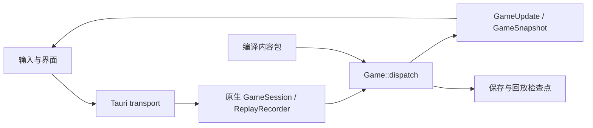

# 架构与代码地图

## 一条玩家命令经过哪里

前端从 [main.ts](../web/src/main.ts)、[input-controller.ts](../web/src/input-controller.ts) 和各面板收集输入，经 [core-transport.ts](../web/src/core-transport.ts) / [tauri-native-transport.ts](../web/src/tauri-native-transport.ts) 调用原生接口。Tauri 的 [GameSession](../web/src-tauri/src/lib.rs)持有 `ReplayRecorder`，把命令序号、预期 revision 与命令一起送入核心。

[Game::dispatch](../crates/rfb-core/src/game/mod.rs)协调前置条件、实际行动、时间推进与输出。Rust 返回权威投影；[game-session.ts](../web/src/game-session.ts)维护客户端会话，[render-world.ts](../web/src/render-world.ts)等组织渲染数据，PixiJS 绘制画面。UI 不自行推演伤害、资源支付或下一回合状态。

## Rust 模块

| crate | 职责 / 入口 |
| --- | --- |
| [rfb-core](../crates/rfb-core/src/lib.rs) | `Game`、动作与效果、RNG、规则状态；build.rs 嵌入已验证内容 |
| [rfb-content](../crates/rfb-content/src/lib.rs) | 定义、源格式、引用验证、程序编译与内容锁 |
| [rfb-protocol](../crates/rfb-protocol/src/lib.rs) | 命令、更新、快照、保存 DTO；生成 TypeScript 和协议 Schema |
| [rfb-save](../crates/rfb-save/src/lib.rs) | 存档字节容器、头部、长度及校验和；游戏状态恢复在 Core |
| [rfb-replay](../crates/rfb-replay/src/lib.rs) | 命令记录、初始状态和状态哈希检查点的重放验证 |
| [rfb-contract](../crates/rfb-contract/src/lib.rs) | fixture 观察、验证、分类与政策 |
| [rfb-localization](../crates/rfb-localization/src/lib.rs) | Rust 侧本地化和相关检查 |
| [rfb-legacy-import](../crates/rfb-legacy-import/src/main.rs) | 选择性内容导入、同步和来源审计 |
| [rfb-legacy-probe](../crates/rfb-legacy-probe/src/main.rs) | 历史原版探测工具；不等于当前游戏运行时 |
| [rfb-tauri](../web/src-tauri/src/lib.rs) | 原生会话、IPC、存档目录及诊断 |

## 规则修改入口

以下路径位于 `crates/rfb-core/src/game/`。先按真实调用者定位，不因为能力名称属于某领域就另开一套运行时。

| 工作 | 文件 / 模块 |
| --- | --- |
| 新游戏、出生物和初始化 | [initialization.rs](../crates/rfb-core/src/game/initialization.rs) |
| 学习、遗忘与玩家能力来源 | [player_abilities.rs](../crates/rfb-core/src/game/player_abilities.rs) |
| 等级/威力计算与说明投影 | [ability_scaling.rs](../crates/rfb-core/src/game/ability_scaling.rs)、[ability_projection.rs](../crates/rfb-core/src/game/ability_projection.rs) |
| 施法事务、取消/续施、目标规划 | [abilities/casting.rs](../crates/rfb-core/src/game/abilities/casting.rs)、[targeting.rs](../crates/rfb-core/src/game/abilities/targeting.rs) |
| 效果执行 | [abilities/](../crates/rfb-core/src/game/abilities/) 下 damage、control、restoration、items、terrain、travel、summoning、compound |
| 角色成长、属性、近战 | [progression.rs](../crates/rfb-core/src/game/progression.rs)、[player_stats.rs](../crates/rfb-core/src/game/player_stats.rs)、[player_combat.rs](../crates/rfb-core/src/game/player_combat.rs) |
| 掉落、物品实例、装备和消耗 | [loot.rs](../crates/rfb-core/src/game/loot.rs)、[inventory.rs](../crates/rfb-core/src/game/inventory.rs)、[item_use.rs](../crates/rfb-core/src/game/item_use.rs)及实际调用模块 |
| 地图、楼层、旅行、城镇、任务 | [world/](../crates/rfb-core/src/game/world/)、[floor.rs](../crates/rfb-core/src/game/floor.rs)、[travel.rs](../crates/rfb-core/src/game/travel.rs)、[town.rs](../crates/rfb-core/src/game/town.rs)、[tasks.rs](../crates/rfb-core/src/game/tasks.rs) |
| 弹道、可见性与光照 | [projectile_geometry.rs](../crates/rfb-core/src/game/projectile_geometry.rs)、[visibility.rs](../crates/rfb-core/src/game/visibility.rs)、[lighting.rs](../crates/rfb-core/src/game/lighting.rs) |
| 保存恢复与状态哈希 | [persistence.rs](../crates/rfb-core/src/game/persistence.rs) |

这些模块仍使用同一个 `Game` 和既有规则入口，没有独立的 manager 或第二份状态。新职责仅在当前行为确实需要时提取；不要为了行数重新拆分已经连贯的流程。

## 内容如何进入运行时

`packs/rfb-demo-original` 的 JSON 由 `rfb-content` 解析、验证并编译。[rfb-core/build.rs](../crates/rfb-core/build.rs)要求源与 `content.lock.json` 一致，把生成的 `.rfbcontent` 写到 Cargo `OUT_DIR`，然后由 Core 嵌入使用。发布游戏不要求旁边再放一份可任意漂移的 JSON 包。

源文件、编译后的定义和运行时实例是不同层次。稳定内容 ID 用于引用定义；实例 ID、资源、位置、知识与状态由核心创建和管理。增加一种物品通常扩充内容；改变所有同类物品的机制才进入对应运行时代码。

## 确定性、存档和协议

[RfbRng](../crates/rfb-core/src/rng.rs)保存算法标识、内部状态及抽取计数。规则不能引入墙钟时间或第二个随机源；顺序、截断、候选集合及 ID 提交时点都可能改变可观察结果。

保存分两层：`rfb-save` 验证字节容器与校验和，`Game::from_save` 验证内容身份和游戏状态。当前读档要求内容 ID/hash 匹配；`contentHash` 不参与 `Game::state_hash` 并不表示存档可跨任意内容版本读取。

协议、存档 payload/header、容器、内容格式和 State Hash Schema 是不同版本轴。以常量和生成器为准；历史类型名中的 `V1` 或 `V98` 不一定是当前 schema 版本，不据此自行升级或增加兼容路径。

## 客户端资源

- 文案：`locales/en-US`、`locales/zh-CN` 与 [localization.ts](../web/src/localization.ts)。
- 图集：`web/public/tilesets` 的 manifest 将稳定语义 ID 映射到 glyph/image；解析契约在 [tileset-manifest.ts](../web/src/tileset-manifest.ts)和 [Schema](../schemas/tileset-v1.schema.json)。
- 美术源：[assets/tilesets/rfb-pixel-28/STYLE.md](../assets/tilesets/rfb-pixel-28/STYLE.md)及同目录源文件。表现资源不会改变核心规则。
- 存档和诊断由 Tauri 负责原生路径；不要把开发缓存当作玩家数据。

精确字段查看代码与 Schema；旧设计推导可在[档案](archive/README.md)按原文件名查找。
